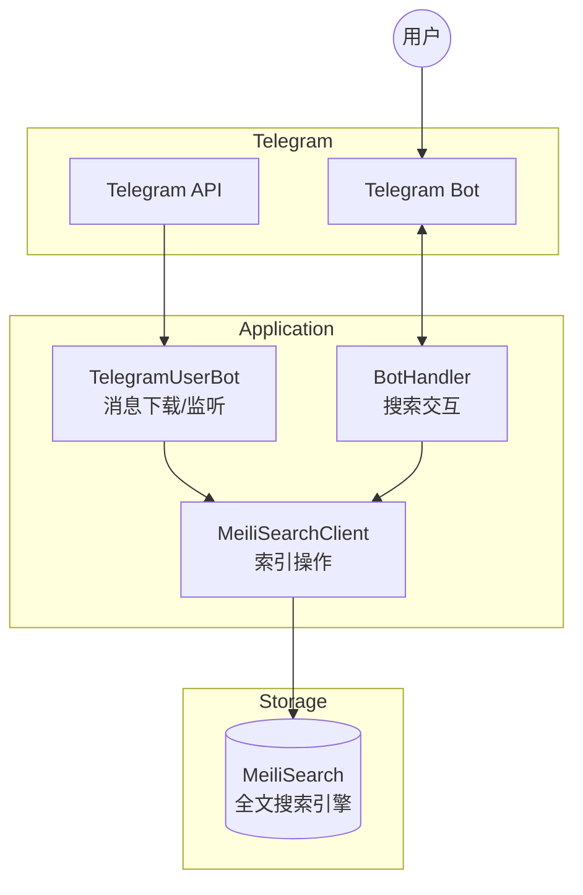

# Meilisearch4TelegramSearchCKJ

> 基于 Telethon + MeiliSearch 的 Telegram 中文/日文/韩文 (CJK) 消息搜索解决方案

**生成时间**: 2026-02-05T10:48:48+0800

---

## 项目概述

Telegram 官方搜索对中文支持不佳（不分词），本项目通过 MeiliSearch 全文搜索引擎解决此问题。

### 核心功能
- **消息下载**: 从 Telegram 下载历史消息到 MeiliSearch
- **实时监听**: 监听新消息并自动索引
- **Bot 搜索**: 通过 Telegram Bot 提供搜索界面
- **黑白名单**: 支持配置要同步的频道/群组/用户

---

## 架构总览



### 数据流
1. **下载流程**: Telegram API → TelegramUserBot → serialize → MeiliSearchClient → MeiliSearch
2. **监听流程**: Telegram Events → Handler → MeiliSearch
3. **搜索流程**: User → Bot → MeiliSearch → 格式化结果 → User

---

## 技术栈

| 类别 | 技术 |
|------|------|
| 语言 | Python 3.12 |
| Telegram 库 | Telethon 1.38+ |
| 搜索引擎 | MeiliSearch 0.33+ |
| 日志 | coloredlogs |
| 容器化 | Docker / Docker Compose |

---

## 目录结构

```
Meilisearch4TelegramSearchCKJ/
├── CLAUDE.md                    # 本文档
├── Dockerfile                   # Docker 构建文件
├── docker-compose.yml           # Docker Compose 配置
├── requirements.txt             # Python 依赖
├── setup.py                     # 包安装配置
└── Meilisearch4TelegramSearchCKJ/
    ├── src/                     # 源代码
    │   ├── main.py              # 主入口 (CLI 模式)
    │   ├── app.py               # Flask 健康检查入口
    │   ├── config/              # 配置模块
    │   ├── models/              # 核心业务逻辑
    │   ├── utils/               # 工具函数
    │   └── session/             # Telethon 会话文件
    └── tests/                   # 测试文件
```

---

## 模块索引

| 模块 | 路径 | 职责 |
|------|------|------|
| **config** | `src/config/` | 环境变量配置管理 |
| **models** | `src/models/` | 核心业务处理器 |
| **utils** | `src/utils/` | 通用工具函数 |
| **tests** | `tests/` | 单元测试与工具脚本 |

详见各模块的 `CLAUDE.md`:
- [src/config/CLAUDE.md](./Meilisearch4TelegramSearchCKJ/src/config/CLAUDE.md)
- [src/models/CLAUDE.md](./Meilisearch4TelegramSearchCKJ/src/models/CLAUDE.md)
- [src/utils/CLAUDE.md](./Meilisearch4TelegramSearchCKJ/src/utils/CLAUDE.md)

---

## 快速命令

> 现在项目使用uv，同时更新了依赖为最新，请注意查阅context7

```bash
# 激活环境变量(环境变量中设置了MEILI、API)
cd /home/sinfor/Games/SteamLibrary/CODE/Meilisearch4TelegramSearchCKJ/.venv
source .venv/bin/activate

# 启动主进程，注意位置，必须与main.py
cd /home/sinfor/Games/SteamLibrary/CODE/Meilisearch4TelegramSearchCKJ/Meilisearch4TelegramSearchCKJ/src
uv run main.
```

```bash
# 安装依赖
uv pip install -r requirements.txt
uv pip install -e .

# 本地运行
cd Meilisearch4TelegramSearchCKJ/src && python main.py

# Docker 运行
docker-compose up -d

# 运行测试
pytest Meilisearch4TelegramSearchCKJ/tests/
```

---

## 环境变量

### 必填
| 变量 | 说明 |
|------|------|
| `APP_ID` | Telegram API ID |
| `APP_HASH` | Telegram API Hash |
| `BOT_TOKEN` | Telegram Bot Token |
| `MEILI_HOST` | MeiliSearch 地址 |
| `MEILI_MASTER_KEY` | MeiliSearch 密钥 |

### 可选
| 变量 | 默认值 | 说明 |
|------|--------|------|
| `WHITE_LIST` | `[1]` | 白名单 (频道/群组/用户 ID) |
| `BLACK_LIST` | `[]` | 黑名单 |
| `OWNER_IDS` | `[]` | Bot 管理员 ID |
| `SESSION_STRING` | - | Telethon 会话字符串 |
| `LOGGING_LEVEL` | `25` | 控制台日志级别 |
| `BATCH_MSG_UNM` | `200` | 批量上传消息数 |
| `TIME_ZONE` | `Asia/Shanghai` | 时区 |

---

## 开发规范

### 代码风格
- 使用类型注解
- 异步函数使用 `async/await`
- 日志使用 `setup_logger()` 获取 logger

### 消息序列化格式
```python
{
    'id': 'chat_id-msg_id',           # 主键
    'chat': {...},                     # 聊天信息
    'date': 'ISO8601',                 # 时间戳
    'text': '...',                     # 消息内容
    'from_user': {...},                # 发送者
    'reactions': {...},                # 表情反应
    'reactions_scores': float          # 情感分数
}
```

---

## 相关链接

- **GitHub**: https://github.com/clionertr/Meilisearch4TelegramSearchCKJ
- **Wiki**: https://github.com/clionertr/Meilisearch4TelegramSearchCKJ/wiki
- **原项目**: https://github.com/tgbot-collection/SearchGram
