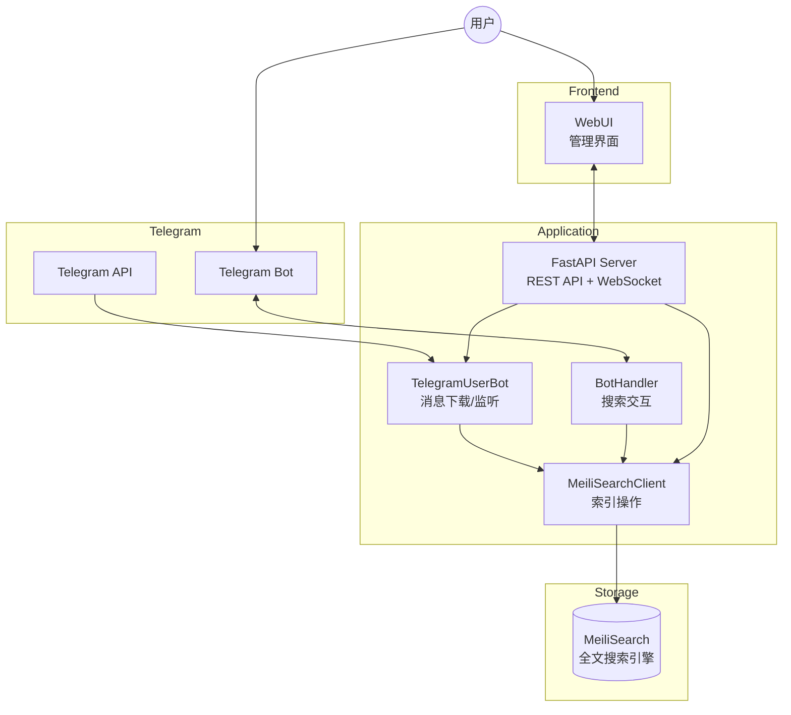

# Meilisearch4TelegramSearchCKJ

> 基于 Telethon + MeiliSearch 的 Telegram 中文/日文/韩文 (CJK) 消息搜索解决方案

**生成时间**: 2026-02-06（最近同步: 2026-02-28）

---

## 变更记录 (Changelog)

### 2026-02-28
- `ConfigStore` 从 MeiliSearch 配置文档迁移到 SQLite（`CONFIG_DB_PATH`）
- 运行时状态拆分：`system_config`（全局配置） + `dialog_state`（会话状态 + `latest_msg_id`）
- Dialog Sync 写路径改为行级 upsert/delete，不再覆盖整份 `sync.dialogs`
- 兼容迁移：SQLite 空库时自动导入 legacy Meili `system_config` + `sync_offsets`
- `DownloadScheduler` 断点续传改为直接读写 ConfigStore `latest_msg_id`

### 2026-02-26
- 文档体系同步更新：重写根 README / `webui-example/README.md`，补齐 API + Bot + WebUI 联调示例
- 新增 WebUI 环境变量模板：`webui-example/.env.example` 与 `.env.development.example`
- 新增 FastAPI 统一访问日志中间件：`[api.access]`（`request_id/method/path/status/duration_ms/client/ua`）
- API 响应统一回传 `X-Request-ID`（可通过 `API_REQUEST_ID_HEADER` 自定义）
- 新增前端 telemetry：`api.start/api.end/api.error/ws.state/ws.message`，用于前后端 request_id 串联排障
- `webui-example/webui_gap_analysis.md` 改造为“Done + Backlog”遗留问题台账
- `.env.example` 补充 API 访问日志与登录会话相关配置说明

### 2026-02-25
- 落地 **SearchService** (`src/tg_search/services/search_service.py`)，统一 Bot/API 搜索过滤、高亮解析、分页与缓存策略
- API `/api/v1/search` 改为薄路由，统一调用 SearchService（保持 OpenAPI schema 不变）
- Bot 搜索链路改为调用 SearchService，分页 callback 从 `split("_")` 迁移为 `base64(json)` + 短 token 回退
- 新增搜索服务真实环境回归：`tests/integration/test_search_service_e2e.py`（API/Bot 首屏一致、`foo_bar` 翻页、无结果语义）
- 新增搜索服务单测：`tests/unit/test_search_service.py`（过滤构建、解析、缓存、分页编码兼容）
- 落地 **ConfigPolicyService** (`src/tg_search/services/config_policy_service.py`)，统一白/黑名单读写入口
- `ConfigStore` 增加 `policy` section（`GlobalConfig.policy`），作为运行时策略单一真源
- API `/api/v1/config/*` 改为调用 ConfigPolicyService，不再读写进程内可变列表
- Bot `/set_white_list2meili`、`/set_black_list2meili` 改为调用 ConfigPolicyService
- 下载与监听链路改为读取统一策略（白/黑名单），并增加策略刷新日志与 TTL 配置
- 新增 `src/tg_search/services/` 包和单测 `tests/unit/test_config_policy_service.py`
- 更新 README 与 `.env.example`：明确“静态配置来自 `.env`，动态策略来自 ConfigStore.policy”
- 新增 `ServiceContainer`（`src/tg_search/services/container.py`），在 API lifespan / BotHandler / `main.run()` 共享同一 service 实例
- `ConfigPolicyService` 新增 `DomainError` 错误模型与 `subscribe()` 推送机制，配置写后即时通知运行时消费者
- 新增 SLA 真实环境回归：`tests/integration/test_service_layer_architecture_e2e.py`（共享容器注入 + `<1s` 配置可见性）
- 落地 **ObservabilityService** (`src/tg_search/services/observability_service.py`)，统一 `/status`、`/search/stats`、`/storage/stats` 与 Bot `/ping` 状态采集
- API `/api/v1/status`、`/api/v1/search/stats`、`/api/v1/storage/stats` 改为调用 ObservabilityService 快照
- Bot `/ping` 改为仅负责文本渲染，Meili 不可用时返回统一“服务不可用”文案
- 新增可观测性回归测试：`tests/unit/test_observability_service.py` + `tests/integration/test_observability_service_e2e.py`
- 新增可观测性配置：`OBS_SNAPSHOT_TIMEOUT_SEC`、`OBS_SNAPSHOT_WARN_MS`
- 落地 **RuntimeControlService** (`src/tg_search/services/runtime_control_service.py`)，统一 Bot/API 的任务启停状态机与并发锁
- API `/api/v1/client/*` 与 Bot `/start_client` `/stop_client` 切换为同一运行控制 service，移除 `BotHandler.download_task` 状态源
- 新增运行控制 E2E：`tests/integration/test_runtime_control_service_e2e.py`（并发、API-only、一致性、强制取消后重启）
- 新增运行控制单测：`tests/unit/test_runtime_control_service.py`、`tests/unit/test_control_route_error_mapping.py`
- 控制链路新增结构化日志：`control.start/control.stop/control.status`，并增加 `status()>50ms` 慢查询告警

### 2026-02-24
- 新增 **ConfigStore** 配置持久化模块 (`config/config_store.py`)，基于 MeiliSearch 实现全局配置读写
- 新增 **Dialog Sync API** (`routes/dialogs.py`)：会话同步管理（available / synced / sync / patch / delete）
- 新增 **AI Config API** (`routes/ai_config.py`)：AI 配置读写与连通性测试
- 新增 **Storage API** (`routes/storage.py`)：存储统计与缓存清理
- 新增 **Dashboard API** (`routes/dashboard.py`)：活动聚合与规则摘要
- 测试目录重组为 `tests/unit/` + `tests/integration/` 二级结构
- 新增大量集成测试：`test_dialog_sync.py`, `test_ai_config.py`, `test_storage.py`, `test_dashboard_e2e.py` 等
- 更新 `.env.example` 补充 `CORS_ORIGINS` 配置
- 更新 `docker-compose.yml` 为生产可用配置
- 更新 `.dockerignore` 适配当前目录结构
- 全面更新所有文档以与代码同步

### 2026-02-17
- 同步重构进度：Phase 1-3 已完成，Phase 4 P0 已完成（主链路打通）
- 修复 WebUI 搜索字段契约，前端对齐后端 `SearchResult`（`total_hits/chat/from_user/formatted_text`）
- 修复 WebUI WebSocket 事件契约，前端按 `type=progress` + `data.dialog_id` 消费
- 清理 Search 页重复防抖逻辑，统一为 300ms
- 删除已冗余的阶段性计划文档 `.claude/plan/phase4_p0_webui.md`

### 2026-02-06 13:48:06
- 新增 **api** 模块文档（FastAPI REST API + WebSocket）
- 新增 **webui-example** 模块文档（React + TypeScript 前端）
- 更新模块结构图，添加 API 层和 WebUI 层
- 更新项目统计：42 个 Python 文件 + 23 个 TypeScript 文件
- 更新测试覆盖：新增 test_api.py、test_api_integration.py
- 更新入口点：新增 API 模式（all/api-only/bot-only）

### 2026-02-05 18:19:02
- 完成项目架构扫描，生成完整文档
- 添加模块结构图（Mermaid）
- 生成 `.claude/index.json` 索引文件
- 创建模块级文档（config、core、utils、tests）

---

## 项目概述

Telegram 官方搜索对中文支持不佳（不分词），本项目通过 MeiliSearch 全文搜索引擎解决此问题。

### 核心功能
- **消息下载**: 从 Telegram 下载历史消息到 MeiliSearch
- **实时监听**: 监听新消息并自动索引
- **Bot 搜索**: 通过 Telegram Bot 提供搜索界面
- **REST API**: 通过 FastAPI 提供 RESTful API（v0.2.0 新增）
- **WebSocket**: 实时推送下载进度（v0.2.0 新增）
- **黑白名单**: 支持配置要同步的频道/群组/用户

---

## 架构总览



### 数据流
1. **下载流程**: Telegram API -> TelegramUserBot -> serialize -> MeiliSearchClient -> MeiliSearch
2. **监听流程**: Telegram Events -> Handler -> MeiliSearch
3. **搜索流程 (Bot)**: User -> Bot -> MeiliSearch -> 格式化结果 -> User
4. **搜索流程 (API)**: WebUI -> FastAPI -> MeiliSearch -> JSON -> WebUI

---

## 技术栈

| 类别 | 技术 |
|------|------|
| 语言 | Python 3.10+ |
| Telegram 库 | Telethon 1.38+ |
| 搜索引擎 | MeiliSearch 0.33+ |
| Web 框架 | FastAPI 0.109+ |
| ASGI 服务器 | Uvicorn 0.27+ |
| 数据验证 | Pydantic 2.5+ |
| 日志 | coloredlogs |
| 重试机制 | tenacity |
| 构建工具 | hatchling (PEP 621) |
| 包管理 | uv |
| 容器化 | Docker / Docker Compose |
| 测试框架 | pytest + pytest-asyncio + httpx |

---

## 模块结构图

```mermaid
graph TD
    A["(根) Meilisearch4TelegramSearchCKJ"] --> B["src/tg_search"];
    B --> C["config"];
    B --> D["core"];
    B --> E["utils"];
    B --> I["services"];
    B --> G["api"];
    A --> F["tests"];
    A --> H["webui-example"];

    C --> C1["settings.py<br/>配置管理"];
    C --> C2["config_store.py<br/>ConfigStore 持久化"];
    D --> D1["bot.py<br/>Bot处理器"];
    D --> D2["telegram.py<br/>TG客户端"];
    D --> D3["meilisearch.py<br/>搜索客户端"];
    D --> D4["logger.py<br/>日志配置"];
    E --> E1["formatters.py<br/>格式化工具"];
    E --> E2["permissions.py<br/>权限检查"];
    E --> E3["message_tracker.py<br/>消息追踪"];
    E --> E4["memory.py<br/>内存监控"];
    I --> I1["config_policy_service.py<br/>策略服务"];
    I --> I2["search_service.py<br/>统一搜索服务"];
    I --> I3["contracts.py<br/>Service DTO"];
    I --> I4["observability_service.py<br/>统一可观测性服务"];
    I --> I5["container.py<br/>Service 容器"];
    I --> I6["runtime_control_service.py<br/>运行控制服务"];
    G --> G1["app.py<br/>FastAPI应用"];
    G --> G2["routes/<br/>API路由"];
    G --> G3["models.py<br/>Pydantic模型"];
    G --> G4["auth_store.py<br/>认证存储"];
    G --> G5["deps.py<br/>依赖注入"];
    G --> G6["state.py<br/>应用状态"];
    H --> H1["src/pages/<br/>页面组件"];
    H --> H2["src/api/<br/>API层"];
    H --> H3["src/store/<br/>状态管理"];
    H --> H4["src/hooks/<br/>React Hooks"];

    click C "./src/tg_search/config/CLAUDE.md" "查看 config 模块文档"
    click D "./src/tg_search/core/CLAUDE.md" "查看 core 模块文档"
    click E "./src/tg_search/utils/CLAUDE.md" "查看 utils 模块文档"
    click G "./src/tg_search/api/CLAUDE.md" "查看 api 模块文档"
    click F "./tests/CLAUDE.md" "查看 tests 模块文档"
    click H "./webui-example/CLAUDE.md" "查看 webui-example 模块文档"
```




## 目录结构

```
Meilisearch4TelegramSearchCKJ/
├── CLAUDE.md                    # 本文档
├── README.md                    # 项目说明
├── pyproject.toml               # 项目配置 (PEP 621)
├── .env.example                 # 环境变量示例
├── Dockerfile                   # Docker 构建文件
├── docker-compose.yml           # Docker Compose 配置
├── docker-compose-windows.yml   # Windows Docker 配置
├── docs/
│   ├── specs/                   # API 规格文档
│   │   ├── SPEC-P0-config-policy-service.md
│   │   ├── SPEC-P0-runtime-control-service.md
│   │   ├── SPEC-P0-search-service.md
│   │   ├── SPEC-P0-service-layer-architecture.md
│   │   ├── SPEC-P1-observability-service.md
│   └── operations/              # 运维手册
│       └── observability.md     # 日志与链路追踪 runbook
├── src/
│   └── tg_search/               # 主包
│       ├── __init__.py
│       ├── __main__.py          # CLI 入口 (python -m tg_search)
│       ├── main.py              # 主入口
│       ├── app.py               # Flask 健康检查入口（遗留）
│       ├── config/              # 配置模块
│       │   ├── __init__.py
│       │   ├── settings.py      # 环境变量配置
│       │   ├── config_store.py  # ConfigStore 配置持久化 (SQLite)
│       │   └── CLAUDE.md        # 模块文档
│       ├── core/                # 核心业务逻辑
│       │   ├── __init__.py
│       │   ├── bot.py           # Bot 处理器
│       │   ├── telegram.py      # Telegram 客户端
│       │   ├── meilisearch.py   # MeiliSearch 客户端
│       │   ├── logger.py        # 日志配置
│       │   └── CLAUDE.md        # 模块文档
│       ├── utils/               # 工具函数
│       │   ├── __init__.py
│       │   ├── formatters.py    # 格式化工具
│       │   ├── permissions.py   # 权限检查
│       │   ├── message_tracker.py # 消息追踪
│       │   ├── memory.py        # 内存监控
│       │   ├── bridge.py        # 桥接模块
│       │   └── CLAUDE.md        # 模块文档
│       ├── services/            # Service 层
│       │   ├── __init__.py
│       │   ├── contracts.py     # 领域 DTO
│       │   ├── search_service.py          # 统一搜索服务
│       │   ├── runtime_control_service.py # 运行控制服务
│       │   ├── config_policy_service.py   # 策略服务
│       │   ├── observability_service.py   # 统一可观测性服务
│       │   └── container.py               # Service 容器
│       └── api/                 # REST API 模块 (v0.2.0)
│           ├── __init__.py
│           ├── app.py           # FastAPI 应用构建
│           ├── models.py        # Pydantic 模型
│           ├── deps.py          # 依赖注入
│           ├── state.py         # 应用状态管理
│           ├── auth_store.py    # 认证存储
│           ├── routes/          # API 路由
│           │   ├── __init__.py  # 路由注册
│           │   ├── auth.py      # 认证端点
│           │   ├── search.py    # 搜索端点
│           │   ├── status.py    # 状态端点
│           │   ├── config.py    # 配置端点
│           │   ├── control.py   # 控制端点
│           │   ├── storage.py   # 存储端点 (P1-ST)
│           │   ├── ai_config.py # AI 配置端点 (P1-AI)
│           │   ├── dashboard.py # Dashboard 端点 (P2-DB)
│           │   ├── dialogs.py   # 会话同步端点 (P0-DS)
│           │   └── ws.py        # WebSocket 端点
│           └── CLAUDE.md        # 模块文档
├── tests/                       # 测试文件
│   ├── conftest.py              # pytest 配置和 fixtures
│   ├── CLAUDE.md                # 模块文档
│   ├── TESTING_GUIDELINES.md     # 测试指南
│   ├── helpers/                 # 测试辅助模块
│   ├── unit/                    # 单元测试
│   │   ├── conftest.py
│   │   ├── test_api.py          # API 端点单元测试
│   │   ├── test_auth_store.py   # 认证存储测试
│   │   ├── test_configparser.py # 配置解析测试
│   │   ├── test_dashboard.py    # Dashboard 单元测试
│   │   ├── test_runtime_control_service.py # Runtime Control 单元测试
│   │   ├── test_control_route_error_mapping.py # Control 路由错误映射测试
│   │   ├── test_logger.py       # 日志测试
│   │   ├── test_meilisearch.py  # MeiliSearch 测试
│   │   ├── test_meilisearch_handler.py # MeiliSearch 客户端测试
│   │   ├── test_observability_service.py # ObservabilityService 单测
│   │   └── test_utils.py        # 工具函数测试
│   └── integration/             # 集成测试
│       ├── conftest.py
│       ├── config.py            # 集成测试配置
│       ├── env_manager.py       # 环境管理器
│       ├── run.py               # 集成测试运行器
│       ├── test_api_e2e.py      # API 端到端测试
│       ├── test_ai_config.py    # AI 配置集成测试
│       ├── test_config_store.py # ConfigStore 集成测试
│       ├── test_config_store_e2e.py  # ConfigStore E2E 测试
│       ├── test_dashboard_e2e.py    # Dashboard E2E 测试
│       ├── test_dialog_sync.py      # Dialog Sync 集成测试
│       ├── test_dialog_sync_e2e.py  # Dialog Sync E2E 测试
│       ├── test_runtime_control_service_e2e.py # Runtime Control E2E 测试
│       ├── test_group_setup.py      # 测试组配置
│       ├── test_observability_service_e2e.py  # Observability E2E 测试
│       └── test_storage.py          # Storage 集成测试
└── webui-example/               # 前端管理界面 (React + TypeScript)
    ├── src/
    │   ├── pages/               # 页面组件
    │   ├── api/                 # API 层
    │   ├── components/          # 公共组件
    │   ├── hooks/               # React Hooks
    │   ├── store/               # 状态管理
    │   ├── types/               # 类型定义
    │   └── utils/               # 工具函数
    ├── CLAUDE.md                # 模块文档
    └── README.md                # 前端说明
```

---

## 运行与开发

### 快速命令

```bash
# 安装依赖
uv sync

# 全模式（API + Bot）
python -m tg_search --mode all

# 仅 API
python -m tg_search --mode api-only

# 仅 Bot
python -m tg_search --mode bot-only
```

Docker:

```bash
docker-compose up -d
```

---

## 5. API 端点（代码真实）

### 5.1 认证

- `POST /api/v1/auth/send-code`
- `POST /api/v1/auth/signin`
- `POST /api/v1/auth/token-login`
- `GET /api/v1/auth/me`
- `POST /api/v1/auth/logout`

### 5.2 搜索

- `GET /api/v1/search`
- `GET /api/v1/search/stats`

### 5.3 状态

- `GET /api/v1/status`
- `GET /api/v1/status/dialogs`
- `GET /api/v1/status/progress`

### 5.4 配置与控制

- `GET /api/v1/config`
- `POST /api/v1/config/whitelist`
- `DELETE /api/v1/config/whitelist`
- `POST /api/v1/config/blacklist`
- `DELETE /api/v1/config/blacklist`
- `GET /api/v1/client/status`
- `POST /api/v1/client/start`
- `POST /api/v1/client/stop`

### 5.5 存储 / AI / Dashboard / Dialog Sync

- Storage:
  - `GET /api/v1/storage/stats`
  - `PATCH /api/v1/storage/auto-clean`
  - `POST /api/v1/storage/cleanup/cache`
  - `POST /api/v1/storage/cleanup/media`
- AI Config:
  - `GET /api/v1/ai/config`
  - `PUT /api/v1/ai/config`
  - `POST /api/v1/ai/config/test`
  - `GET /api/v1/ai/models`
- Dashboard:
  - `GET /api/v1/dashboard/activity`
  - `GET /api/v1/dashboard/brief`
- Dialog Sync:
  - `GET /api/v1/dialogs/available`
  - `GET /api/v1/dialogs/synced`
  - `POST /api/v1/dialogs/sync`
  - `PATCH /api/v1/dialogs/{id}/sync-state`
  - `DELETE /api/v1/dialogs/{id}/sync`

### 5.6 WebSocket

- `GET /api/v1/ws/status`（WebSocket）

---

## 6. 鉴权矩阵

- `search/status/config/client/storage`: `API Key` 或 `Bearer`（`verify_api_key_or_bearer_token`）
- `ai/*`, `dashboard/*`, `dialogs/*`: `Bearer-only`
- `auth/*`: 登录链路不要求 Bearer
- `ws/status`:
  - 若未配置 `API_KEY`，允许匿名连接
  - 若配置了 `API_KEY`，需 `?token=<bearer_token>`

---

## 7. 环境变量（按代码分组）

### 7.1 必填

- `APP_ID`
- `APP_HASH`
- `BOT_TOKEN`
- `MEILI_HOST`
- `MEILI_MASTER_KEY`

### 7.2 运行控制 / 可观测性

- `API_ONLY`
- `DISABLE_BOT_AUTOSTART`
- `DISABLE_AUTH_CLEANUP_TASK`
- `OBS_SNAPSHOT_TIMEOUT_SEC`
- `OBS_SNAPSHOT_WARN_MS`
- `API_ACCESS_LOG_ENABLED`
- `API_ACCESS_LOG_SLOW_MS`
- `API_ACCESS_LOG_SKIP_PATHS`
- `API_REQUEST_ID_HEADER`
- `ENABLE_TRACEMALLOC`
- `DEBUG`

### 7.3 配置与性能

- `WHITE_LIST`, `BLACK_LIST`, `POLICY_REFRESH_TTL_SEC`
- `SEARCH_CACHE`, `CACHE_EXPIRE_SECONDS`
- `MAX_PAGE`, `RESULTS_PER_PAGE`
- `SEARCH_PRESENTATION_MAX_HITS`, `SEARCH_CALLBACK_TOKEN_TTL_SEC`
- `BATCH_MSG_UNM`, `NOT_RECORD_MSG`
- `CONFIG_STORE_WAIT_TASK_TIMEOUT_MS`

### 7.4 鉴权与联调

- `API_KEY`, `API_KEY_HEADER`
- `AUTH_TOKEN_STORE_FILE`
- `API_AUTH_SESSION_FILE`
- `ALLOW_TEST_TOKEN_ISSUE`
- `DISABLE_THREAD_OFFLOAD`
- `CORS_ORIGINS`

---

## 8. 可观测性（当前实现）

### 8.1 统一访问日志

- 事件前缀: `[api.access]`
- 核心字段: `request_id method path status duration_ms client ua`
- 响应头回传: `X-Request-ID`（可配置）

### 8.2 业务日志

- `SearchService`: 搜索耗时/缓存命中/分页 callback 编解码
- `RuntimeControlService`: 启停动作与状态
- `ObservabilityService`: snapshot 耗时 + errors/notes
- `dialogs` 路由: `available/synced/sync/patch/delete` 的结构化动作日志
- `ai_config` 路由: `get/put/test/models` 的结果日志（不输出 api_key）
- `ws` 路由: `connection_id` 维度的连接/认证/收发异常日志

---

## 9. 测试策略

- 单元测试: `tests/unit/`（无外部依赖）
- 集成测试: `tests/integration/`（真实 MeiliSearch）

常用命令:


# 运行测试
pytest tests/

# 代码检查
ruff check src/
ruff format src/
```

### 运行模式

| 模式 | 命令 | 说明 |
|------|------|------|
| `all` (默认) | `python -m tg_search` | 同时运行 API 服务器和 Bot |
| `api-only` | `python -m tg_search --mode api-only` | 仅运行 API 服务器 |
| `bot-only` | `python -m tg_search --mode bot-only` | 仅运行 Bot（原有行为） |

### 环境变量

#### 必填
| 变量 | 说明 |
|------|------|
| `APP_ID` | Telegram API ID |
| `APP_HASH` | Telegram API Hash |
| `BOT_TOKEN` | Telegram Bot Token |
| `MEILI_HOST` | MeiliSearch 地址 |
| `MEILI_MASTER_KEY` | MeiliSearch 密钥 |

#### 可选（Bot 相关）
| 变量 | 默认值 | 说明 |
|------|--------|------|
| `WHITE_LIST` | `[1]` | 策略服务冷启动白名单默认值 |
| `BLACK_LIST` | `[]` | 策略服务冷启动黑名单默认值 |
| `CONFIG_DB_PATH` | `session/config_store.sqlite3` | 运行时配置/会话状态 SQLite 路径 |
| `POLICY_REFRESH_TTL_SEC` | `10` | Telegram 监听器策略刷新间隔（秒） |
| `OWNER_IDS` | `[]` | Bot 管理员 ID |
| `SESSION_STRING` | - | Telethon 会话字符串 |
| `LOGGING_LEVEL` | `25` | 控制台日志级别 (INFO=20, NOTICE=25, WARNING=30) |
| `LOGGING2FILE_LEVEL` | `30` | 文件日志级别 |
| `OBS_SNAPSHOT_TIMEOUT_SEC` | `0.8` | 统一可观测性快照采集超时（秒） |
| `OBS_SNAPSHOT_WARN_MS` | `800` | 可观测性快照慢采集告警阈值（毫秒） |
| `BATCH_MSG_UNM` | `200` | 批量上传消息数 |

#### 可选（API 相关）
| 变量 | 默认值 | 说明 |
|------|--------|------|
| `API_KEY` | `None` | API 密钥（未设置则无需认证） |
| `API_KEY_HEADER` | `X-API-Key` | API 密钥请求头名称 |
| `AUTH_TOKEN_STORE_FILE` | `session/auth_tokens.json` | Bearer Token 持久化文件路径（空为仅内存） |
| `API_AUTH_SESSION_FILE` | `session/api_auth.session` | 认证流程 Telethon 会话文件（send-code/signin） |
| `CORS_ORIGINS` | `http://localhost:5173,http://localhost:3000` | 允许的 CORS 源 |
| `API_ACCESS_LOG_ENABLED` | `true` | 是否启用统一 API 访问日志 |
| `API_ACCESS_LOG_SLOW_MS` | `800` | API 慢请求告警阈值（毫秒） |
| `API_ACCESS_LOG_SKIP_PATHS` | `/health,/docs,/redoc,/openapi.json,/docs/oauth2-redirect` | 访问日志跳过路径 |
| `API_REQUEST_ID_HEADER` | `X-Request-ID` | 请求链路追踪 header 名称 |

#### 可选（搜索相关）
| 变量 | 默认值 | 说明 |
|------|--------|------|
| `TIME_ZONE` | `Asia/Shanghai` | 时区 |
| `SEARCH_CACHE` | `True` | 是否开启搜索缓存 |
| `CACHE_EXPIRE_SECONDS` | `7200` | 缓存过期时间（秒） |
| `MAX_PAGE` | `10` | 最大分页数 |
| `RESULTS_PER_PAGE` | `5` | 每页显示消息数 |
| `ENABLE_TRACEMALLOC` | `true` | 是否启用 tracemalloc 内存统计 |

---

## API 端点概览

### 认证端点 (无需认证)

| 方法 | 路径 | 说明 |
|------|------|------|
| POST | `/api/v1/auth/send-code` | 发送 Telegram 验证码 |
| POST | `/api/v1/auth/signin` | 验证码登录 |
| GET | `/api/v1/auth/me` | 获取当前用户信息 |
| POST | `/api/v1/auth/logout` | 登出 |

### 搜索端点 (需要认证)

| 方法 | 路径 | 说明 |
|------|------|------|
| GET | `/api/v1/search` | 搜索消息 |
| GET | `/api/v1/search/stats` | 搜索统计 |

### 状态端点 (需要认证)

| 方法 | 路径 | 说明 |
|------|------|------|
| GET | `/api/v1/status` | 系统状态 |
| GET | `/api/v1/status/dialogs` | 对话列表 |
| GET | `/api/v1/status/progress` | 下载进度 |

### 配置端点 (需要认证)

| 方法 | 路径 | 说明 |
|------|------|------|
| GET | `/api/v1/config` | 获取配置 |
| POST | `/api/v1/config/whitelist` | 添加白名单 ID |
| DELETE | `/api/v1/config/whitelist` | 移除白名单 ID |
| POST | `/api/v1/config/blacklist` | 添加黑名单 ID |
| DELETE | `/api/v1/config/blacklist` | 移除黑名单 ID |

### 控制端点 (需要认证)

| 方法 | 路径 | 说明 |
|------|------|------|
| GET | `/api/v1/client/status` | 客户端状态 |
| POST | `/api/v1/client/start` | 启动下载 |
| POST | `/api/v1/client/stop` | 停止下载 |

`GET /api/v1/client/status` 返回统一运行控制快照：
- `is_running`：是否运行中
- `state`：`stopped|starting|running|stopping`
- `last_action_source`：最近动作来源（`api` / `bot` / `bot_auto`）
- `last_error`：最近一次错误（无则 `null`）

### 存储端点 (需要认证, P1-ST)

| 方法 | 路径 | 说明 |
|------|------|------|
| GET | `/api/v1/storage/stats` | 存储统计信息 |
| PATCH | `/api/v1/storage/auto-clean` | 配置自动清理 |
| POST | `/api/v1/storage/cleanup/cache` | 清理缓存 |
| POST | `/api/v1/storage/cleanup/media` | 清理媒体（当前未启用） |

### AI 配置端点 (Bearer-only, P1-AI)

| 方法 | 路径 | 说明 |
|------|------|------|
| GET | `/api/v1/ai/config` | 获取 AI 配置（不回显 api_key） |
| PUT | `/api/v1/ai/config` | 更新 AI 配置 |
| POST | `/api/v1/ai/config/test` | AI 连通性测试 |
| GET | `/api/v1/ai/models` | 获取可用模型列表 |

### Dashboard 端点 (Bearer-only, P2-DB)

| 方法 | 路径 | 说明 |
|------|------|------|
| GET | `/api/v1/dashboard/activity` | 活动聚合列表 |
| GET | `/api/v1/dashboard/brief` | 规则摘要 |

### 会话同步端点 (Bearer-only, P0-DS)

| 方法 | 路径 | 说明 |
|------|------|------|
| GET | `/api/v1/dialogs/available` | 可用会话列表（带 120s 缓存） |
| GET | `/api/v1/dialogs/synced` | 已同步会话列表 |
| POST | `/api/v1/dialogs/sync` | 批量开启会话同步 |
| PATCH | `/api/v1/dialogs/{id}/sync-state` | 修改同步状态 |
| DELETE | `/api/v1/dialogs/{id}/sync` | 删除同步配置 |

### WebSocket

| 路径 | 说明 |
|------|------|
| `/api/v1/ws/status` | 实时下载进度推送 |

### API 文档

- Swagger UI: `http://localhost:8000/docs`
- ReDoc: `http://localhost:8000/redoc`
- OpenAPI JSON: `http://localhost:8000/openapi.json`

---

## 测试策略

### 测试架构

测试分为两层，位于 `tests/` 目录下：

- **`tests/unit/`** — 单元测试（Mock 驱动，无外部依赖）
  - MeiliSearchClient、工具函数、权限检查、认证存储
  - FastAPI 端点单元测试（使用 TestClient + Mock）
  - Dashboard 单元测试
- **`tests/integration/`** — 集成测试（需要真实 MeiliSearch 实例）
  - ConfigStore 集成/E2E 测试
  - Dialog Sync 集成/E2E 测试
  - AI Config 集成测试
  - Storage 集成测试
  - Dashboard E2E 测试
  - API 端到端测试

### 运行测试
```bash
# 运行所有测试
pytest tests/

# 仅运行单元测试
pytest tests/unit/

# 仅运行集成测试（需要 MeiliSearch）
pytest tests/integration/

# 运行特定测试文件
pytest tests/unit/test_meilisearch_handler.py

# 生成覆盖率报告
pytest --cov=src/tg_search --cov-report=html tests/
```

### Fixtures
- `mock_meilisearch_client`: Mock MeiliSearch 客户端
- `mock_telegram_client`: Mock Telegram 客户端
- `sample_documents`: 示例文档数据
- `mock_logger`: Mock 日志记录器
- `test_client`: FastAPI TestClient（带 Mock 状态）

---

## 编码规范

### 代码风格
- 使用类型注解（Python 3.10+ 语法）
- 异步函数使用 `async/await`
- 日志使用 `setup_logger()` 获取 logger
- 使用 ruff 进行代码格式化和检查
- 行长度限制：120 字符

### 导入规范
```python
# 正确的导入方式
from tg_search.config.settings import APP_ID, APP_HASH
from tg_search.core.meilisearch import MeiliSearchClient
from tg_search.utils.formatters import sizeof_fmt
from tg_search.api.models import ApiResponse, SearchResult
```

### 异常处理规范
```python
# 自定义异常类型
from tg_search.core.telegram import (
    TelegramNetworkError,      # 网络错误（可重试）
    TelegramPermissionError,   # 权限错误（不可重试）
    TelegramRateLimitError,    # 限流错误（需等待）
)

from tg_search.core.meilisearch import (
    MeiliSearchConnectionError,  # 连接错误
    MeiliSearchTimeoutError,     # 超时错误
    MeiliSearchAPIError,         # API 错误
)

# 重试机制使用 tenacity
from tenacity import retry, stop_after_attempt, wait_exponential
```

### 消息序列化格式
```python
{
    'id': 'chat_id-msg_id',           # 主键（编辑消息为 chat_id-msg_id-edit_ts）
    'chat': {                          # 聊天信息
        'id': int,
        'type': 'private'|'group'|'channel',
        'title': str | None,
        'username': str | None
    },
    'date': 'ISO8601',                 # 时间戳（Asia/Shanghai 时区）
    'text': '...',                     # 消息内容或 caption
    'from_user': {                     # 发送者
        'id': int,
        'username': str | None
    },
    'reactions': {                     # 表情反应（emoji: count）
        '!': 5,
        '!': 3
    } | None,
    'reactions_scores': float | None,  # 情感分数（基于 TELEGRAM_REACTIONS 权重）
    'text_len': int                    # 文本长度
}
```

---

## AI 使用指引

### 项目结构
本项目采用 **PEP 621** 标准结构：
- 源代码位于 `src/tg_search/`
- 使用 `pyproject.toml` 管理依赖
- 使用 `uv` 作为包管理器

### 修改代码时的注意事项
1. **异步函数**: 所有 Telegram 和 MeiliSearch 操作都是异步的，请使用 `async/await`
2. **异常处理**: 区分网络错误、权限错误、限流错误，使用自定义异常类
3. **重试机制**: MeiliSearchClient 已集成 tenacity 重试，Telegram 操作需手动处理
4. **类型注解**: 所有函数参数和返回值都应有类型注解
5. **日志记录**: 使用 `logger.info()`, `logger.log(25, ...)`, `logger.error()` 等
6. **API 开发**: 使用 Pydantic 模型定义请求/响应，使用依赖注入获取共享资源

### 常见任务
- **添加新配置**: 在 `src/tg_search/config/settings.py` 中添加环境变量
- **添加新 Bot 命令**: 在 `src/tg_search/core/bot.py` 中注册事件处理器
- **添加新 API 端点**: 在 `src/tg_search/api/routes/` 中创建新路由模块
- **修改消息序列化**: 编辑 `src/tg_search/core/telegram.py` 中的 `serialize_message` 函数
- **添加工具函数**: 在 `src/tg_search/utils/` 中创建新模块

### 调试技巧
```bash
pytest tests/unit -v
RUN_INTEGRATION_TESTS=true pytest tests/integration -v
pytest -m unit -v
```

---

## 10. 文档索引

- 根 README: `README.md`
- API 模块文档: `src/tg_search/api/CLAUDE.md`
- Config 模块文档: `src/tg_search/config/CLAUDE.md`
- Core 模块文档: `src/tg_search/core/CLAUDE.md`
- Utils 模块文档: `src/tg_search/utils/CLAUDE.md`
- 测试文档: `tests/CLAUDE.md`, `tests/TESTING_GUIDELINES.md`
- 可观测性 Runbook: `docs/operations/observability.md`
- 非最佳实现缺口台账: `docs/operations/non_best_gap.md`
- WebUI 文档: `webui-example/README.md`, `webui-example/CLAUDE.md`

---

## 11. 历史兼容与遗留说明

- `src/tg_search/app.py` 是 Flask 遗留健康检查入口，不属于当前推荐主链路。
- 当前推荐统一入口: `python -m tg_search`（由 `__main__.py` 驱动）。

---

## 12. 本次更新（2026-02-28）

- 全面清理过期目录/端点/测试路径描述，确保与代码一致。
- 补充真实鉴权矩阵、环境变量分组、可观测性日志点。
- 补充遗留入口说明，降低新成员误判风险。
