# Meilisearch4TelegramSearchCKJ

> 基于 Telethon + MeiliSearch 的 Telegram 中文/日文/韩文 (CJK) 消息搜索解决方案

**生成时间**: 2026-02-05

---

## 变更记录 (Changelog)

### 2026-02-05 18:19:02
- 完成项目架构扫描，生成完整文档
- 添加模块结构图（Mermaid）
- 生成 `.claude/index.json` 索引文件
- 创建模块级文档（config、core、utils、tests）
- 覆盖率：100% (27/27 文件已扫描)

---

## 项目概述

Telegram 官方搜索对中文支持不佳（不分词），本项目通过 MeiliSearch 全文搜索引擎解决此问题。

### 核心功能
- **消息下载**: 从 Telegram 下载历史消息到 MeiliSearch
- **实时监听**: 监听新消息并自动索引
- **Bot 搜索**: 通过 Telegram Bot 提供搜索界面
- **黑白名单**: 支持配置要同步的频道/群组/用户

---

## 架构总览

```mermaid
graph TB
    subgraph Telegram
        TG_API[Telegram API]
        TG_BOT[Telegram Bot]
    end

    subgraph Application
        UC[TelegramUserBot<br/>消息下载/监听]
        BH[BotHandler<br/>搜索交互]
        MH[MeiliSearchClient<br/>索引操作]
    end

    subgraph Storage
        MS[(MeiliSearch<br/>全文搜索引擎)]
    end

    TG_API --> UC
    UC --> MH
    BH --> MH
    MH --> MS
    TG_BOT <--> BH

    User((用户)) --> TG_BOT
```



### 数据流
1. **下载流程**: Telegram API → TelegramUserBot → serialize → MeiliSearchClient → MeiliSearch
2. **监听流程**: Telegram Events → Handler → MeiliSearch
3. **搜索流程**: User → Bot → MeiliSearch → 格式化结果 → User

---

## 技术栈

| 类别 | 技术 |
|------|------|
| 语言 | Python 3.10+ |
| Telegram 库 | Telethon 1.38+ |
| 搜索引擎 | MeiliSearch 0.33+ |
| 日志 | coloredlogs |
| 重试机制 | tenacity |
| 构建工具 | hatchling (PEP 621) |
| 包管理 | uv |
| 容器化 | Docker / Docker Compose |
| 测试框架 | pytest + pytest-asyncio |

---

## 模块结构图

```mermaid
graph TD
    A["(根) Meilisearch4TelegramSearchCKJ"] --> B["src/tg_search"];
    B --> C["config"];
    B --> D["core"];
    B --> E["utils"];
    A --> F["tests"];

    C --> C1["settings.py<br/>配置管理"];
    D --> D1["bot.py<br/>Bot处理器"];
    D --> D2["telegram.py<br/>TG客户端"];
    D --> D3["meilisearch.py<br/>搜索客户端"];
    D --> D4["logger.py<br/>日志配置"];
    E --> E1["formatters.py<br/>格式化工具"];
    E --> E2["permissions.py<br/>权限检查"];
    E --> E3["message_tracker.py<br/>消息追踪"];
    E --> E4["memory.py<br/>内存监控"];

    click C "./src/tg_search/config/CLAUDE.md" "查看 config 模块文档"
    click D "./src/tg_search/core/CLAUDE.md" "查看 core 模块文档"
    click E "./src/tg_search/utils/CLAUDE.md" "查看 utils 模块文档"
    click F "./tests/CLAUDE.md" "查看 tests 模块文档"
```



---

## 模块索引

| 模块 | 路径 | 职责 | 文档链接 |
|------|------|------|----------|
| **config** | `src/tg_search/config/` | 环境变量配置管理与验证 | [查看文档](./src/tg_search/config/CLAUDE.md) |
| **core** | `src/tg_search/core/` | 核心业务处理器（Bot/Telegram/MeiliSearch） | [查看文档](./src/tg_search/core/CLAUDE.md) |
| **utils** | `src/tg_search/utils/` | 通用工具函数（格式化/权限/追踪） | [查看文档](./src/tg_search/utils/CLAUDE.md) |
| **tests** | `tests/` | 单元测试与集成测试 | [查看文档](./tests/CLAUDE.md) |

---

## 目录结构

```
Meilisearch4TelegramSearchCKJ/
├── CLAUDE.md                    # 本文档
├── pyproject.toml               # 项目配置 (PEP 621)
├── Dockerfile                   # Docker 构建文件
├── docker-compose.yml           # Docker Compose 配置
├── .claude/
│   └── index.json               # 项目索引（AI工具用）
├── src/
│   └── tg_search/               # 主包
│       ├── __init__.py
│       ├── __main__.py          # CLI 入口 (python -m tg_search)
│       ├── main.py              # 主入口
│       ├── app.py               # Flask 健康检查入口
│       ├── config/              # 配置模块
│       │   ├── __init__.py
│       │   ├── settings.py      # 环境变量配置
│       │   └── CLAUDE.md        # 模块文档
│       ├── core/                # 核心业务逻辑
│       │   ├── __init__.py
│       │   ├── bot.py           # Bot 处理器
│       │   ├── telegram.py      # Telegram 客户端
│       │   ├── meilisearch.py   # MeiliSearch 客户端
│       │   ├── logger.py        # 日志配置
│       │   └── CLAUDE.md        # 模块文档
│       ├── utils/               # 工具函数
│       │   ├── __init__.py
│       │   ├── formatters.py    # 格式化工具
│       │   ├── permissions.py   # 权限检查
│       │   ├── message_tracker.py # 消息追踪
│       │   ├── memory.py        # 内存监控
│       │   └── CLAUDE.md        # 模块文档
│       └── session/             # Telethon 会话文件
└── tests/                       # 测试文件
    ├── conftest.py              # pytest 配置和 fixtures
    ├── test_meilisearch_handler.py
    ├── test_utils.py
    ├── test_logger.py
    ├── test_tg_client.py
    ├── test_configparser.py
    └── CLAUDE.md                # 模块文档
```

---

## 运行与开发

### 快速命令

```bash
# 激活环境变量
cd /home/sinfor/Games/SteamLibrary/CODE/Meilisearch4TelegramSearchCKJ
source .venv/bin/activate

# 安装依赖（使用 uv）
uv sync

# 安装开发依赖
uv sync --extra dev

# 本地运行（方式 1：模块方式）
python -m tg_search

# 本地运行（方式 2：命令行入口）
tg-search

# Docker 运行
docker-compose up -d

# 运行测试
pytest tests/

# 代码检查
ruff check src/
ruff format src/
```

### 环境变量

#### 必填
| 变量 | 说明 |
|------|------|
| `APP_ID` | Telegram API ID |
| `APP_HASH` | Telegram API Hash |
| `BOT_TOKEN` | Telegram Bot Token |
| `MEILI_HOST` | MeiliSearch 地址 |
| `MEILI_MASTER_KEY` | MeiliSearch 密钥 |

#### 可选
| 变量 | 默认值 | 说明 |
|------|--------|------|
| `WHITE_LIST` | `[1]` | 白名单 (频道/群组/用户 ID) |
| `BLACK_LIST` | `[]` | 黑名单 |
| `OWNER_IDS` | `[]` | Bot 管理员 ID |
| `SESSION_STRING` | - | Telethon 会话字符串 |
| `LOGGING_LEVEL` | `25` | 控制台日志级别 (INFO=20, NOTICE=25, WARNING=30) |
| `LOGGING2FILE_LEVEL` | `30` | 文件日志级别 |
| `BATCH_MSG_UNM` | `200` | 批量上传消息数 |
| `TIME_ZONE` | `Asia/Shanghai` | 时区 |
| `SEARCH_CACHE` | `True` | 是否开启搜索缓存 |
| `CACHE_EXPIRE_SECONDS` | `7200` | 缓存过期时间（秒） |
| `MAX_PAGE` | `10` | 最大分页数 |
| `RESULTS_PER_PAGE` | `5` | 每页显示消息数 |

---

## 测试策略

### 测试覆盖
- **单元测试**: MeiliSearchClient、工具函数、权限检查
- **Mock 测试**: Telegram 客户端、异步操作
- **异常测试**: 网络错误、超时、权限错误
- **重试机制测试**: tenacity 重试验证

### 运行测试
```bash
# 运行所有测试
pytest tests/

# 运行特定测试文件
pytest tests/test_meilisearch_handler.py

# 生成覆盖率报告
pytest --cov=src/tg_search --cov-report=html tests/

# 查看覆盖率报告
open htmlcov/index.html
```

### Fixtures
- `mock_meilisearch_client`: Mock MeiliSearch 客户端
- `mock_telegram_client`: Mock Telegram 客户端
- `sample_documents`: 示例文档数据
- `mock_logger`: Mock 日志记录器

---

## 编码规范

### 代码风格
- 使用类型注解（Python 3.10+ 语法）
- 异步函数使用 `async/await`
- 日志使用 `setup_logger()` 获取 logger
- 使用 ruff 进行代码格式化和检查
- 行长度限制：120 字符

### 导入规范
```python
# 正确的导入方式
from tg_search.config.settings import APP_ID, APP_HASH
from tg_search.core.meilisearch import MeiliSearchClient
from tg_search.utils.formatters import sizeof_fmt
```

### 异常处理规范
```python
# 自定义异常类型
from tg_search.core.telegram import (
    TelegramNetworkError,      # 网络错误（可重试）
    TelegramPermissionError,   # 权限错误（不可重试）
    TelegramRateLimitError,    # 限流错误（需等待）
)

from tg_search.core.meilisearch import (
    MeiliSearchConnectionError,  # 连接错误
    MeiliSearchTimeoutError,     # 超时错误
    MeiliSearchAPIError,         # API 错误
)

# 重试机制使用 tenacity
from tenacity import retry, stop_after_attempt, wait_exponential
```

### 消息序列化格式
```python
{
    'id': 'chat_id-msg_id',           # 主键（编辑消息为 chat_id-msg_id-edit_ts）
    'chat': {                          # 聊天信息
        'id': int,
        'type': 'private'|'group'|'channel',
        'title': str | None,
        'username': str | None
    },
    'date': 'ISO8601',                 # 时间戳（Asia/Shanghai 时区）
    'text': '...',                     # 消息内容或 caption
    'from_user': {                     # 发送者
        'id': int,
        'username': str | None
    },
    'reactions': {                     # 表情反应（emoji: count）
        '👍': 5,
        '❤️': 3
    } | None,
    'reactions_scores': float | None,  # 情感分数（基于 TELEGRAM_REACTIONS 权重）
    'text_len': int                    # 文本长度
}
```

---

## AI 使用指引

### 项目结构
本项目采用 **PEP 621** 标准结构：
- 源代码位于 `src/tg_search/`
- 使用 `pyproject.toml` 管理依赖
- 使用 `uv` 作为包管理器

### 修改代码时的注意事项
1. **异步函数**: 所有 Telegram 和 MeiliSearch 操作都是异步的，请使用 `async/await`
2. **异常处理**: 区分网络错误、权限错误、限流错误，使用自定义异常类
3. **重试机制**: MeiliSearchClient 已集成 tenacity 重试，Telegram 操作需手动处理
4. **类型注解**: 所有函数参数和返回值都应有类型注解
5. **日志记录**: 使用 `logger.info()`, `logger.log(25, ...)`, `logger.error()` 等

### 常见任务
- **添加新配置**: 在 `src/tg_search/config/settings.py` 中添加环境变量
- **添加新 Bot 命令**: 在 `src/tg_search/core/bot.py` 中注册事件处理器
- **修改消息序列化**: 编辑 `src/tg_search/core/telegram.py` 中的 `serialize_message` 函数
- **添加工具函数**: 在 `src/tg_search/utils/` 中创建新模块

### 调试技巧
```python
# 启用内存跟踪
export ENABLE_TRACEMALLOC=true

# 跳过配置验证（测试时）
export SKIP_CONFIG_VALIDATION=true

# 调整日志级别
export LOGGING_LEVEL=20  # INFO
export LOGGING_LEVEL=25  # NOTICE（默认）
export LOGGING_LEVEL=30  # WARNING
```

---

## 相关链接

- **GitHub**: https://github.com/clionertr/Meilisearch4TelegramSearchCKJ
- **Wiki**: https://github.com/clionertr/Meilisearch4TelegramSearchCKJ/wiki
- **原项目**: https://github.com/tgbot-collection/SearchGram
- **MeiliSearch 文档**: https://www.meilisearch.com/docs
- **Telethon 文档**: https://docs.telethon.dev

---

## 故障排查

### 常见问题

1. **配置验证失败**
   ```
   ConfigurationError: 配置验证失败，以下必填项存在问题
   ```
   解决：检查 `.env` 文件或环境变量，确保所有必填项（APP_ID、APP_HASH、BOT_TOKEN、MEILI_HOST、MEILI_MASTER_KEY）已正确设置

2. **MeiliSearch 连接错误**
   ```
   MeiliSearchConnectionError: 无法连接到 MeiliSearch
   ```
   解决：确认 MEILI_HOST 可访问，MEILI_MASTER_KEY 正确

3. **Telegram 限流**
   ```
   TelegramRateLimitError: 限流，需等待 XX 秒
   ```
   解决：程序会自动等待，也可减小 BATCH_MSG_UNM 值

4. **权限错误**
   ```
   TelegramPermissionError: 权限错误
   ```
   解决：检查 Telegram 账号是否有权限访问目标频道/群组

### 日志位置
- 控制台日志：实时输出
- 文件日志：`log_file.log`（级别 WARNING 及以上）

---

## 贡献指南

1. Fork 本仓库
2. 创建特性分支 (`git checkout -b feature/AmazingFeature`)
3. 提交更改 (`git commit -m 'Add some AmazingFeature'`)
4. 推送到分支 (`git push origin feature/AmazingFeature`)
5. 开启 Pull Request

### 代码审查清单
- [ ] 所有测试通过 (`pytest tests/`)
- [ ] 代码格式化 (`ruff format src/`)
- [ ] 代码检查通过 (`ruff check src/`)
- [ ] 添加必要的类型注解
- [ ] 更新相关文档
