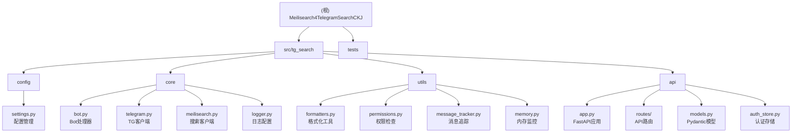

# Meilisearch4TelegramSearchCKJ

> 基于 Telethon + MeiliSearch 的 Telegram 中文/日文/韩文 (CJK) 消息搜索解决方案

**生成时间**: 2026-02-06

---

## 变更记录 (Changelog)

### 2026-02-06 13:48:06
- 新增 **api** 模块文档（FastAPI REST API + WebSocket）
- 更新模块结构图，添加 API 层
- 更新项目统计：42 个 Python 文件（新增 15 个 API 相关文件）
- 更新测试覆盖：新增 test_api.py、test_api_integration.py
- 更新入口点：新增 API 模式（all/api-only/bot-only）

### 2026-02-05 18:19:02
- 完成项目架构扫描，生成完整文档
- 添加模块结构图（Mermaid）
- 生成 `.claude/index.json` 索引文件
- 创建模块级文档（config、core、utils、tests）

---

## 项目概述

Telegram 官方搜索对中文支持不佳（不分词），本项目通过 MeiliSearch 全文搜索引擎解决此问题。

### 核心功能
- **消息下载**: 从 Telegram 下载历史消息到 MeiliSearch
- **实时监听**: 监听新消息并自动索引
- **Bot 搜索**: 通过 Telegram Bot 提供搜索界面
- **REST API**: 通过 FastAPI 提供 RESTful API（v0.2.0 新增）
- **WebSocket**: 实时推送下载进度（v0.2.0 新增）
- **黑白名单**: 支持配置要同步的频道/群组/用户

---

## 架构总览


### 数据流
1. **下载流程**: Telegram API -> TelegramUserBot -> serialize -> MeiliSearchClient -> MeiliSearch
2. **监听流程**: Telegram Events -> Handler -> MeiliSearch
3. **搜索流程 (Bot)**: User -> Bot -> MeiliSearch -> 格式化结果 -> User
4. **搜索流程 (API)**: WebUI -> FastAPI -> MeiliSearch -> JSON -> WebUI

---

## 技术栈

| 类别 | 技术 |
|------|------|
| 语言 | Python 3.10+ |
| Telegram 库 | Telethon 1.38+ |
| 搜索引擎 | MeiliSearch 0.33+ |
| Web 框架 | FastAPI 0.109+ |
| ASGI 服务器 | Uvicorn 0.27+ |
| 数据验证 | Pydantic 2.5+ |
| 日志 | coloredlogs |
| 重试机制 | tenacity |
| 构建工具 | hatchling (PEP 621) |
| 包管理 | uv |
| 容器化 | Docker / Docker Compose |
| 测试框架 | pytest + pytest-asyncio + httpx |

---

## 模块结构图



---

## 模块索引

| 模块 | 路径 | 职责 | 文档链接 |
|------|------|------|----------|
| **config** | `src/tg_search/config/` | 环境变量配置管理与验证 | [查看文档](./src/tg_search/config/CLAUDE.md) |
| **core** | `src/tg_search/core/` | 核心业务处理器（Bot/Telegram/MeiliSearch） | [查看文档](./src/tg_search/core/CLAUDE.md) |
| **utils** | `src/tg_search/utils/` | 通用工具函数（格式化/权限/追踪） | [查看文档](./src/tg_search/utils/CLAUDE.md) |
| **api** | `src/tg_search/api/` | FastAPI REST API 与 WebSocket | [查看文档](./src/tg_search/api/CLAUDE.md) |
| **tests** | `tests/` | 单元测试与集成测试 | [查看文档](./tests/CLAUDE.md) |

---

## 目录结构

```
Meilisearch4TelegramSearchCKJ/
├── CLAUDE.md                    # 本文档
├── pyproject.toml               # 项目配置 (PEP 621)
├── Dockerfile                   # Docker 构建文件
├── docker-compose.yml           # Docker Compose 配置
├── .claude/
│   └── index.json               # 项目索引（AI工具用）
├── src/
│   └── tg_search/               # 主包
│       ├── __init__.py
│       ├── __main__.py          # CLI 入口 (python -m tg_search)
│       ├── main.py              # 主入口
│       ├── app.py               # Flask 健康检查入口（遗留）
│       ├── config/              # 配置模块
│       │   ├── __init__.py
│       │   ├── settings.py      # 环境变量配置
│       │   └── CLAUDE.md        # 模块文档
│       ├── core/                # 核心业务逻辑
│       │   ├── __init__.py
│       │   ├── bot.py           # Bot 处理器
│       │   ├── telegram.py      # Telegram 客户端
│       │   ├── meilisearch.py   # MeiliSearch 客户端
│       │   ├── logger.py        # 日志配置
│       │   └── CLAUDE.md        # 模块文档
│       ├── utils/               # 工具函数
│       │   ├── __init__.py
│       │   ├── formatters.py    # 格式化工具
│       │   ├── permissions.py   # 权限检查
│       │   ├── message_tracker.py # 消息追踪
│       │   ├── memory.py        # 内存监控
│       │   ├── bridge.py        # 桥接模块
│       │   └── CLAUDE.md        # 模块文档
│       ├── api/                 # REST API 模块 (v0.2.0)
│       │   ├── __init__.py
│       │   ├── app.py           # FastAPI 应用构建
│       │   ├── models.py        # Pydantic 模型
│       │   ├── deps.py          # 依赖注入
│       │   ├── state.py         # 应用状态管理
│       │   ├── auth_store.py    # 认证存储
│       │   ├── routes/          # API 路由
│       │   │   ├── __init__.py
│       │   │   ├── auth.py      # 认证端点
│       │   │   ├── search.py    # 搜索端点
│       │   │   ├── status.py    # 状态端点
│       │   │   ├── config.py    # 配置端点
│       │   │   ├── control.py   # 控制端点
│       │   │   └── ws.py        # WebSocket 端点
│       │   └── CLAUDE.md        # 模块文档
│       └── session/             # Telethon 会话文件
└── tests/                       # 测试文件
    ├── conftest.py              # pytest 配置和 fixtures
    ├── test_meilisearch_handler.py
    ├── test_utils.py
    ├── test_logger.py
    ├── test_tg_client.py
    ├── test_configparser.py
    ├── test_api.py              # API 端点测试
    ├── test_api_integration.py  # API 集成测试
    └── CLAUDE.md                # 模块文档
```

---

## 运行与开发

### 快速命令

```bash
# 激活环境变量
cd /home/sinfor/Games/SteamLibrary/CODE/Meilisearch4TelegramSearchCKJ
source .venv/bin/activate

# 安装依赖（使用 uv）
uv sync

# 安装开发依赖
uv sync --extra dev

# 本地运行（默认模式：API + Bot）
python -m tg_search

# 仅运行 API 服务器
python -m tg_search --mode api-only

# 仅运行 Bot（无 API）
python -m tg_search --mode bot-only

# 自定义端口运行
python -m tg_search --host 0.0.0.0 --port 8080

# 开发模式（热重载）
python -m tg_search --reload

# Docker 运行
docker-compose up -d

# 运行测试
pytest tests/

# 代码检查
ruff check src/
ruff format src/
```

### 运行模式

| 模式 | 命令 | 说明 |
|------|------|------|
| `all` (默认) | `python -m tg_search` | 同时运行 API 服务器和 Bot |
| `api-only` | `python -m tg_search --mode api-only` | 仅运行 API 服务器 |
| `bot-only` | `python -m tg_search --mode bot-only` | 仅运行 Bot（原有行为） |

### 环境变量

#### 必填
| 变量 | 说明 |
|------|------|
| `APP_ID` | Telegram API ID |
| `APP_HASH` | Telegram API Hash |
| `BOT_TOKEN` | Telegram Bot Token |
| `MEILI_HOST` | MeiliSearch 地址 |
| `MEILI_MASTER_KEY` | MeiliSearch 密钥 |

#### 可选（Bot 相关）
| 变量 | 默认值 | 说明 |
|------|--------|------|
| `WHITE_LIST` | `[1]` | 白名单 (频道/群组/用户 ID) |
| `BLACK_LIST` | `[]` | 黑名单 |
| `OWNER_IDS` | `[]` | Bot 管理员 ID |
| `SESSION_STRING` | - | Telethon 会话字符串 |
| `LOGGING_LEVEL` | `25` | 控制台日志级别 (INFO=20, NOTICE=25, WARNING=30) |
| `LOGGING2FILE_LEVEL` | `30` | 文件日志级别 |
| `BATCH_MSG_UNM` | `200` | 批量上传消息数 |

#### 可选（API 相关）
| 变量 | 默认值 | 说明 |
|------|--------|------|
| `API_KEY` | `None` | API 密钥（未设置则无需认证） |
| `API_KEY_HEADER` | `X-API-Key` | API 密钥请求头名称 |
| `CORS_ORIGINS` | `http://localhost:5173,http://localhost:3000` | 允许的 CORS 源 |

#### 可选（搜索相关）
| 变量 | 默认值 | 说明 |
|------|--------|------|
| `TIME_ZONE` | `Asia/Shanghai` | 时区 |
| `SEARCH_CACHE` | `True` | 是否开启搜索缓存 |
| `CACHE_EXPIRE_SECONDS` | `7200` | 缓存过期时间（秒） |
| `MAX_PAGE` | `10` | 最大分页数 |
| `RESULTS_PER_PAGE` | `5` | 每页显示消息数 |

---

## API 端点概览

### 认证端点 (无需认证)

| 方法 | 路径 | 说明 |
|------|------|------|
| POST | `/api/v1/auth/send-code` | 发送 Telegram 验证码 |
| POST | `/api/v1/auth/signin` | 验证码登录 |
| GET | `/api/v1/auth/me` | 获取当前用户信息 |
| POST | `/api/v1/auth/logout` | 登出 |

### 搜索端点 (需要认证)

| 方法 | 路径 | 说明 |
|------|------|------|
| GET | `/api/v1/search` | 搜索消息 |
| GET | `/api/v1/search/stats` | 搜索统计 |

### 状态端点 (需要认证)

| 方法 | 路径 | 说明 |
|------|------|------|
| GET | `/api/v1/status` | 系统状态 |
| GET | `/api/v1/status/dialogs` | 对话列表 |
| GET | `/api/v1/status/progress` | 下载进度 |

### 配置端点 (需要认证)

| 方法 | 路径 | 说明 |
|------|------|------|
| GET | `/api/v1/config` | 获取配置 |
| POST | `/api/v1/config/whitelist` | 设置白名单 |
| POST | `/api/v1/config/blacklist` | 设置黑名单 |

### 控制端点 (需要认证)

| 方法 | 路径 | 说明 |
|------|------|------|
| GET | `/api/v1/client/status` | 客户端状态 |
| POST | `/api/v1/client/start` | 启动下载 |
| POST | `/api/v1/client/stop` | 停止下载 |

### WebSocket

| 路径 | 说明 |
|------|------|
| `/api/v1/ws/progress` | 实时下载进度推送 |

### API 文档

- Swagger UI: `http://localhost:8000/docs`
- ReDoc: `http://localhost:8000/redoc`
- OpenAPI JSON: `http://localhost:8000/openapi.json`

---

## 测试策略

### 测试覆盖
- **单元测试**: MeiliSearchClient、工具函数、权限检查
- **API 测试**: FastAPI 端点测试（使用 TestClient）
- **Mock 测试**: Telegram 客户端、异步操作
- **异常测试**: 网络错误、超时、权限错误
- **重试机制测试**: tenacity 重试验证

### 运行测试
```bash
# 运行所有测试
pytest tests/

# 运行特定测试文件
pytest tests/test_meilisearch_handler.py

# 运行 API 测试
pytest tests/test_api.py

# 生成覆盖率报告
pytest --cov=src/tg_search --cov-report=html tests/

# 查看覆盖率报告
open htmlcov/index.html
```

### Fixtures
- `mock_meilisearch_client`: Mock MeiliSearch 客户端
- `mock_telegram_client`: Mock Telegram 客户端
- `sample_documents`: 示例文档数据
- `mock_logger`: Mock 日志记录器
- `test_client`: FastAPI TestClient（带 Mock 状态）

---

## 编码规范

### 代码风格
- 使用类型注解（Python 3.10+ 语法）
- 异步函数使用 `async/await`
- 日志使用 `setup_logger()` 获取 logger
- 使用 ruff 进行代码格式化和检查
- 行长度限制：120 字符

### 导入规范
```python
# 正确的导入方式
from tg_search.config.settings import APP_ID, APP_HASH
from tg_search.core.meilisearch import MeiliSearchClient
from tg_search.utils.formatters import sizeof_fmt
from tg_search.api.models import ApiResponse, SearchResult
```

### 异常处理规范
```python
# 自定义异常类型
from tg_search.core.telegram import (
    TelegramNetworkError,      # 网络错误（可重试）
    TelegramPermissionError,   # 权限错误（不可重试）
    TelegramRateLimitError,    # 限流错误（需等待）
)

from tg_search.core.meilisearch import (
    MeiliSearchConnectionError,  # 连接错误
    MeiliSearchTimeoutError,     # 超时错误
    MeiliSearchAPIError,         # API 错误
)

# 重试机制使用 tenacity
from tenacity import retry, stop_after_attempt, wait_exponential
```

### 消息序列化格式
```python
{
    'id': 'chat_id-msg_id',           # 主键（编辑消息为 chat_id-msg_id-edit_ts）
    'chat': {                          # 聊天信息
        'id': int,
        'type': 'private'|'group'|'channel',
        'title': str | None,
        'username': str | None
    },
    'date': 'ISO8601',                 # 时间戳（Asia/Shanghai 时区）
    'text': '...',                     # 消息内容或 caption
    'from_user': {                     # 发送者
        'id': int,
        'username': str | None
    },
    'reactions': {                     # 表情反应（emoji: count）
        '!': 5,
        '!': 3
    } | None,
    'reactions_scores': float | None,  # 情感分数（基于 TELEGRAM_REACTIONS 权重）
    'text_len': int                    # 文本长度
}
```

---

## AI 使用指引

### 项目结构
本项目采用 **PEP 621** 标准结构：
- 源代码位于 `src/tg_search/`
- 使用 `pyproject.toml` 管理依赖
- 使用 `uv` 作为包管理器

### 修改代码时的注意事项
1. **异步函数**: 所有 Telegram 和 MeiliSearch 操作都是异步的，请使用 `async/await`
2. **异常处理**: 区分网络错误、权限错误、限流错误，使用自定义异常类
3. **重试机制**: MeiliSearchClient 已集成 tenacity 重试，Telegram 操作需手动处理
4. **类型注解**: 所有函数参数和返回值都应有类型注解
5. **日志记录**: 使用 `logger.info()`, `logger.log(25, ...)`, `logger.error()` 等
6. **API 开发**: 使用 Pydantic 模型定义请求/响应，使用依赖注入获取共享资源

### 常见任务
- **添加新配置**: 在 `src/tg_search/config/settings.py` 中添加环境变量
- **添加新 Bot 命令**: 在 `src/tg_search/core/bot.py` 中注册事件处理器
- **添加新 API 端点**: 在 `src/tg_search/api/routes/` 中创建新路由模块
- **修改消息序列化**: 编辑 `src/tg_search/core/telegram.py` 中的 `serialize_message` 函数
- **添加工具函数**: 在 `src/tg_search/utils/` 中创建新模块

### 调试技巧
```bash
# 启用内存跟踪
export ENABLE_TRACEMALLOC=true

# 跳过配置验证（测试时）
export SKIP_CONFIG_VALIDATION=true

# 调整日志级别
export LOGGING_LEVEL=20  # INFO
export LOGGING_LEVEL=25  # NOTICE（默认）
export LOGGING_LEVEL=30  # WARNING

# 启用 API 调试模式
export DEBUG=true
```

---

## 相关链接

- **GitHub**: https://github.com/clionertr/Meilisearch4TelegramSearchCKJ
- **Wiki**: https://github.com/clionertr/Meilisearch4TelegramSearchCKJ/wiki
- **原项目**: https://github.com/tgbot-collection/SearchGram
- **MeiliSearch 文档**: https://www.meilisearch.com/docs
- **Telethon 文档**: https://docs.telethon.dev
- **FastAPI 文档**: https://fastapi.tiangolo.com

---

## 故障排查

### 常见问题

1. **配置验证失败**
   ```
   ConfigurationError: 配置验证失败，以下必填项存在问题
   ```
   解决：检查 `.env` 文件或环境变量，确保所有必填项（APP_ID、APP_HASH、BOT_TOKEN、MEILI_HOST、MEILI_MASTER_KEY）已正确设置

2. **MeiliSearch 连接错误**
   ```
   MeiliSearchConnectionError: 无法连接到 MeiliSearch
   ```
   解决：确认 MEILI_HOST 可访问，MEILI_MASTER_KEY 正确

3. **Telegram 限流**
   ```
   TelegramRateLimitError: 限流，需等待 XX 秒
   ```
   解决：程序会自动等待，也可减小 BATCH_MSG_UNM 值

4. **权限错误**
   ```
   TelegramPermissionError: 权限错误
   ```
   解决：检查 Telegram 账号是否有权限访问目标频道/群组

5. **API 认证失败**
   ```
   401 Unauthorized
   ```
   解决：检查 API_KEY 配置或 Bearer Token 是否正确

### 日志位置
- 控制台日志：实时输出
- 文件日志：`log_file.log`（级别 WARNING 及以上）

---

## 贡献指南

1. Fork 本仓库
2. 创建特性分支 (`git checkout -b feature/AmazingFeature`)
3. 提交更改 (`git commit -m 'Add some AmazingFeature'`)
4. 推送到分支 (`git push origin feature/AmazingFeature`)
5. 开启 Pull Request

### 代码审查清单
- [ ] 所有测试通过 (`pytest tests/`)
- [ ] 代码格式化 (`ruff format src/`)
- [ ] 代码检查通过 (`ruff check src/`)
- [ ] 添加必要的类型注解
- [ ] 更新相关文档
