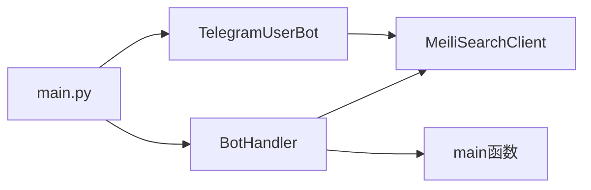

# models 模块

> [根目录](../../../CLAUDE.md) > [src](../CLAUDE.md) > models

---

## 模块职责

核心业务逻辑层，包含 Telegram 客户端、Bot 处理器、MeiliSearch 客户端和日志配置。

---

## 关键文件

| 文件 | 职责 | 入口类/函数 |
|------|------|-------------|
| `telegram_client_handler.py` | Telegram 用户客户端，消息下载/监听 | `TelegramUserBot` |
| `bot_handler.py` | Telegram Bot 交互，搜索命令处理 | `BotHandler` |
| `meilisearch_handler.py` | MeiliSearch 索引操作封装 | `MeiliSearchClient` |
| `logger.py` | 日志配置 | `setup_logger()` |

---

## 类接口

### TelegramUserBot

```python
class TelegramUserBot:
    def __init__(self, meili_client: MeiliSearchClient)
    async def start()                    # 启动客户端并注册处理器
    async def download_history(peer, ...)  # 下载历史消息
    async def cleanup()                  # 清理资源
    def get_memory_usage() -> Tuple[int, int]  # 内存使用
```

**事件处理器**:
- `events.NewMessage` → 新消息索引
- `events.MessageEdited` → 编辑消息更新

**消息序列化函数**:
```python
async def serialize_message(message: Message) -> dict
async def serialize_chat(chat) -> dict
async def serialize_reactions(message) -> dict
async def calculate_reaction_score(reactions) -> float
```

---

### BotHandler

```python
class BotHandler:
    def __init__(self, main: Callable)   # main 为下载任务入口
    async def run()                      # 启动 Bot
    async def initialize()               # 注册命令处理器
```

**Bot 命令**:
| 命令 | 功能 |
|------|------|
| `/start`, `/help` | 帮助信息 |
| `/start_client` | 启动消息下载/监听 |
| `/stop_client` | 停止下载任务 |
| `/search <关键词>` | 搜索消息 |
| `/set_white_list2meili [...]` | 设置白名单 |
| `/set_black_list2meili [...]` | 设置黑名单 |
| `/cc` | 清除搜索缓存 |
| `/ping` | 检查服务状态 |
| `/about` | 项目信息 |

**装饰器**: `@set_permission` - 检查用户是否在 `OWNER_IDS` 中

---

### MeiliSearchClient

```python
class MeiliSearchClient:
    def __init__(self, host: str, api_key: str)
    def create_index(index_name: str = 'telegram') -> TaskInfo
    def add_documents(documents: List[Dict]) -> TaskInfo
    def search(query: str, index_name: str, **kwargs) -> Dict
    def delete_index(index_name: str) -> TaskInfo
    def get_index_stats(index_name: str) -> IndexStats
```

**默认索引**: `telegram` (消息), `config` (配置)

---

### setup_logger()

```python
def setup_logger() -> logging.Logger
```

- 返回配置好的 logger，支持 coloredlogs 彩色输出
- 自定义日志级别: `NOTICE = 25`
- 同时输出到控制台和 `log_file.log`

---

## 依赖关系


