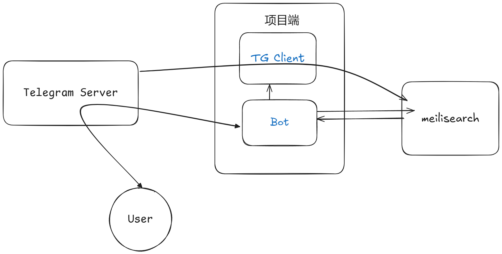

# 展示

# 介绍

Telegram 由于中文搜索不断词，官方搜索是灾难性的，pyrogram 太久没维护，性能也跟不上。因此搓了个基于 telethon 和 meilisearch 的解决方案

本项目的功能的架构大致如下

TG Client：从Telegram 下载和监听消息到meilisearch

meilisearch：储存消息、增量配置、黑白名单

Bot：与用户交互，可视作melisearch的前端、启动TG Client

# 部署 

见[wiki-安装](https://github.com/clionertr/Meilisearch4TelegramSearchCKJ/wiki/%E5%AE%89%E8%A3%85)

# 使用

正在施工

## 结尾

项目从 [GitHub - tgbot-collection/SearchGram: 🔠 Telegram 中文聊天记录搜索机器人 Effortlessly search your Telegram chat history, including CJK languages, with fuzzy and typo-tolerant search capabilities.](https://github.com/tgbot-collection/SearchGram)
重构而来，感谢原作者的付出

非常感谢 telethon 的作者和维护者们，同时也感谢 Claude3.5s 和 GeminiExp 的帮助

从这次项目中学习到很多，希望大家喜欢这个项目
