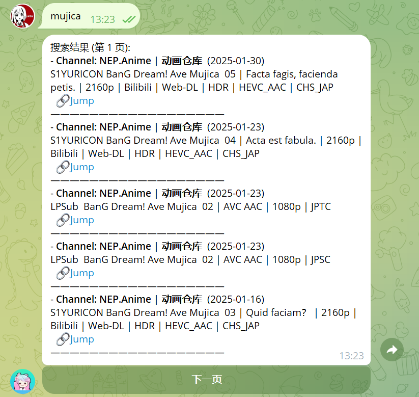

# Meilisearch4TelegramSearchCKJ

> 基于 Telethon + MeiliSearch 的 Telegram CJK（中文/日文/韩文）消息搜索系统，包含 Bot、REST API 与 WebUI。



## 项目状态

- 当前版本：`0.2.0`
- 核心链路：`ServiceContainer + SearchService + ConfigPolicyService + RuntimeControlService + ObservabilityService`
- 前端状态：WebUI 已可用，但仍有历史遗留问题（见 [webui-example/webui_gap_analysis.md](webui-example/webui_gap_analysis.md)）

## 核心能力

- Telegram 历史消息下载与实时监听
- MeiliSearch 全文检索（CJK 友好）
- Telegram Bot 搜索与分页
- FastAPI REST API + WebSocket 进度推送
- WebUI 管理界面（登录、搜索、会话同步、存储、AI 配置、Dashboard）
- 运行时配置与会话状态持久化（SQLite：`system_config` + `dialog_state`）

## 架构概览

- `TelegramUserBot` 负责下载和监听消息
- `MeiliSearchClient` 负责索引写入和搜索
- `SearchService` 统一 Bot/API 的搜索语义（过滤、高亮、分页）
- `ConfigPolicyService` 统一动态策略读写
- `RuntimeControlService` 统一 Bot/API 启停状态机
- `ObservabilityService` 统一 `/status`、`/search/stats`、`/storage/stats` 与 Bot `/ping`

---

## 快速开始

### 1) Docker 启动（推荐）

```bash
git clone https://github.com/clionertr/Meilisearch4TelegramSearchCKJ.git
cd Meilisearch4TelegramSearchCKJ
cp .env.example .env
# 编辑 .env：至少填 APP_ID/APP_HASH/BOT_TOKEN/MEILI_MASTER_KEY

docker-compose up -d
```

启动后：
- API: `http://localhost:8000`
- 文档: `http://localhost:8000/docs`
- MeiliSearch: `http://localhost:7700`

### 2) 本地后端启动

```bash
uv sync
cp .env.example .env
python -m tg_search --mode all
```

常用模式：

```bash
# API + Bot
python -m tg_search --mode all

# 仅 API
python -m tg_search --mode api-only

# 仅 Bot
python -m tg_search --mode bot-only
```

### 3) 本地 WebUI 启动

```bash
cd webui-example
cp .env.development.example .env.development
npm install
npm run dev
```

默认访问：`http://localhost:3000`

---

## 环境变量分层

### 后端（根目录 `.env`）

请基于 `.env.example` 配置，关键变量：

- 必填：`APP_ID`, `APP_HASH`, `BOT_TOKEN`, `MEILI_HOST`, `MEILI_MASTER_KEY`
- 运行时状态库：`CONFIG_DB_PATH`（默认 `session/config_store.sqlite3`）
- 鉴权：`AUTH_TOKEN_STORE_FILE`（Bearer Token 持久化）
- 可观测性：`OBS_SNAPSHOT_TIMEOUT_SEC`, `OBS_SNAPSHOT_WARN_MS`
- 访问日志：`API_ACCESS_LOG_ENABLED`, `API_ACCESS_LOG_SLOW_MS`, `API_ACCESS_LOG_SKIP_PATHS`, `API_REQUEST_ID_HEADER`

首次升级到 SQLite 配置存储时，如果 `CONFIG_DB_PATH` 指向的数据库为空，系统会自动尝试从旧版
MeiliSearch `system_config`（配置）和 `sync_offsets`（断点）导入数据。

### WebUI（`webui-example/.env*`）

- 模板：`webui-example/.env.example`
- 本地联调推荐：`webui-example/.env.development.example`

关键变量：

- `VITE_API_URL`：后端 API 前缀（推荐 `/api/v1` 配合 Vite proxy）
- `VITE_ENABLE_DEBUG_LOGS`：前端 telemetry 开关
- `VITE_SLOW_API_WARN_MS`：前端慢请求告警阈值

---

## 认证说明

- 受保护 HTTP 端点统一采用 `Authorization: Bearer <token>`。
- 登录流程通过 `/api/v1/auth/send-code` + `/api/v1/auth/signin` 获取 Bearer Token。
- WebSocket `/api/v1/ws/status` 保持 `?token=<bearer_token>` 方式传递 token。

---

## README 使用示例

以下示例默认你已设置：

```bash
export API_BASE="http://localhost:8000/api/v1"
export BEARER_TOKEN="<your_bearer_token>"
```

### 1) 查看系统状态

```bash
curl -s "$API_BASE/status" \
  -H "Authorization: Bearer $BEARER_TOKEN" | jq '.data | {uptime_seconds, meili_connected, telegram_connected, indexed_messages, notes}'
```

### 2) 查看并更新策略（白/黑名单）

```bash
curl -s "$API_BASE/config" \
  -H "Authorization: Bearer $BEARER_TOKEN" | jq '.data | {white_list, black_list}'
```

```bash
curl -s -X POST "$API_BASE/config/whitelist" \
  -H "Authorization: Bearer $BEARER_TOKEN" \
  -H "Content-Type: application/json" \
  -d '{"ids":[-1001234567890]}' | jq
```

```bash
curl -s -X POST "$API_BASE/config/blacklist" \
  -H "Authorization: Bearer $BEARER_TOKEN" \
  -H "Content-Type: application/json" \
  -d '{"ids":[-1002222222222]}' | jq
```

### 3) 启停运行任务（统一状态机）

```bash
curl -s -X POST "$API_BASE/client/start" \
  -H "Authorization: Bearer $BEARER_TOKEN" | jq '.data'

curl -s "$API_BASE/client/status" \
  -H "Authorization: Bearer $BEARER_TOKEN" | jq '.data | {is_running,state,last_action_source,last_error}'

curl -s -X POST "$API_BASE/client/stop" \
  -H "Authorization: Bearer $BEARER_TOKEN" | jq '.data'
```

### 4) 搜索消息（带过滤）

```bash
curl -s "$API_BASE/search?q=keyword&chat_type=group&limit=5&offset=0" \
  -H "Authorization: Bearer $BEARER_TOKEN" | jq '.data | {query,total_hits,limit,offset,hits:[.hits[] | {id,formatted_text,chat:.chat.title}]}'
```

### 5) 拉取索引/存储快照

```bash
curl -s "$API_BASE/search/stats" \
  -H "Authorization: Bearer $BEARER_TOKEN" | jq '.data | {total_documents,index_size_bytes,last_update,is_indexing,notes}'

curl -s "$API_BASE/storage/stats" \
  -H "Authorization: Bearer $BEARER_TOKEN" | jq '.data | {total_bytes,index_bytes,media_supported,notes}'
```

### 6) Bot 侧常用命令

```text
/search foo_bar
/start_client
/stop_client
/ping
/set_white_list2meili [-1001234567890]
/set_black_list2meili [-1002222222222]
```

---

## 监控与日志点

### 后端日志（`log_file.log` + 控制台）

新增统一访问日志：

- 事件：`[api.access]`
- 字段：`request_id method path status duration_ms client ua`
- 慢请求阈值：`API_ACCESS_LOG_SLOW_MS`（默认 800ms）
- 每个 HTTP 响应会回传 `X-Request-ID`（或你配置的 `API_REQUEST_ID_HEADER`）

已有关键结构化日志：

- `SearchService`: 搜索耗时、缓存命中、callback 编解码模式
- `RuntimeControlService` / `control.*`: 启停动作与状态
- `ObservabilityService`: 快照采集耗时、降级 notes/errors
- `ws.auth`: WebSocket 鉴权拒绝原因（missing/invalid/auth unavailable）

快速过滤：

```bash
grep -E "api.access|SearchService|RuntimeControlService|ObservabilityService|control\." log_file.log
```

### 前端 telemetry（浏览器控制台）

开启方式：

```bash
# webui-example/.env.development
VITE_ENABLE_DEBUG_LOGS=true
VITE_SLOW_API_WARN_MS=800
```

可观测事件：

- `api.start` / `api.end` / `api.error`（含 request_id、状态码、耗时）
- `ws.state` / `ws.message`

用于和后端 `api.access` 的 `request_id` 做端到端串联排查。

---

## 测试与质量检查

```bash
# 后端单元 + 集成
pytest tests/

# 格式与静态检查
ruff check src/
ruff format src/

# WebUI 构建验证
cd webui-example
npm run build
```

---

## 文档索引

- 总体架构与开发约定: [CLAUDE.md](CLAUDE.md)
- WebUI 模块文档: [webui-example/CLAUDE.md](webui-example/CLAUDE.md)
- WebUI 遗留问题台账: [webui-example/webui_gap_analysis.md](webui-example/webui_gap_analysis.md)
- 可观测性运维手册: [docs/operations/observability.md](docs/operations/observability.md)
- 规格文档: `docs/specs/`

## License

MIT
