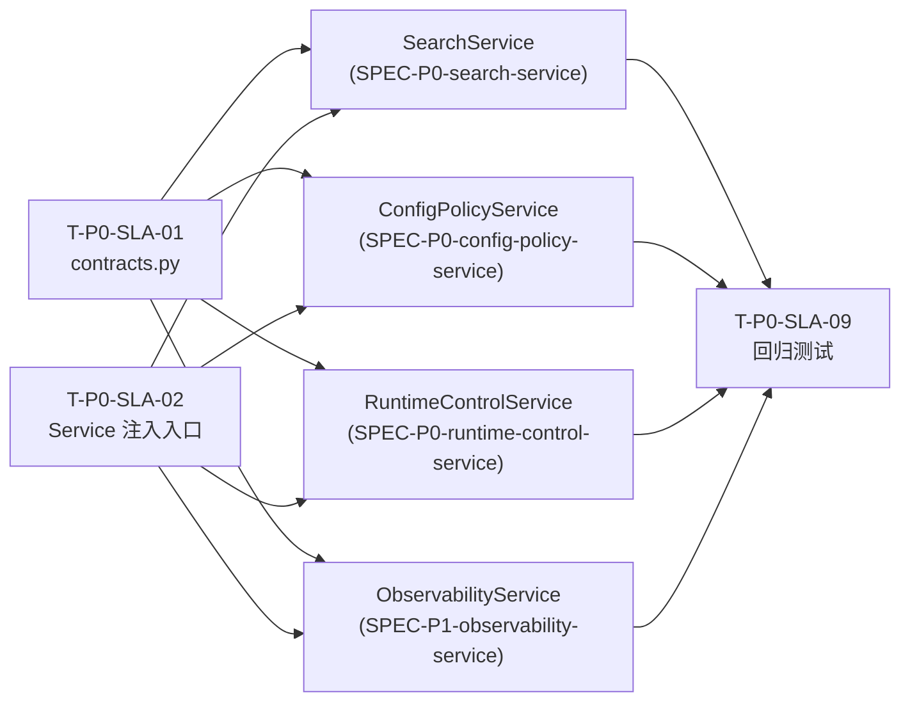

# 功能名称：P0-Service 层分层改造总纲（Bot/API 共享业务逻辑）

## 1. 业务目标（一句话）
建立统一 Service 层，将 Bot 与 API 统一收敛为 Presentation Layer，消除重复业务逻辑与行为漂移。

## 2. 验收标准（Given-When-Then 格式）
1. Given 项目完成本阶段改造，When 检查 `bot.py` 与 `api/routes/*.py`，Then 路由与命令处理器不再直接编排核心业务流程（仅做参数解析、调用 Service、结果渲染）。
2. Given 同一业务能力（搜索、配置、运行控制、状态查询）同时被 Bot 和 API 使用，When 对比行为，Then 返回语义一致、错误码映射一致。
3. Given 业务逻辑需要访问 MeiliSearch/Telegram/ConfigStore，When 代码审查依赖方向，Then 仅 Service 层依赖基础设施，Presentation 层不直接访问底层客户端。
4. Given 发生业务规则变更（例如过滤规则或状态字段），When 仅修改 Service，Then Bot 与 API 两侧自动生效且无需重复改动。
5. Given 改造完成后运行现有单元和集成测试，When 执行测试集，Then 关键回归用例通过（搜索、配置、控制、状态）。

## 3. 简单的技术设计 & 非功能需求
### 3.1 现状审查结论（来自 Bot/API 代码）
- 搜索逻辑分散：Bot 侧自带搜索、缓存、分页；API 侧自带 filter builder、hit 解析，行为不统一。
- 配置真源分裂：Bot 写入 Meili `config` 索引；API 仅改 `settings.WHITE_LIST/BLACK_LIST`（进程内），导致重启与跨入口不一致。
- 运行控制重复：Bot 与 API 各自维护下载任务状态，缺少统一生命周期控制。
- 状态聚合重复：Bot `/ping` 与 API `/status` `/search/stats` `/storage/stats` 分别自行组装统计。

### 3.2 目标分层
- `Presentation Layer`：`core/bot.py`、`api/routes/*.py`
- `Service Layer`：新增 `src/tg_search/services/`
- `Infrastructure Layer`：`core/meilisearch.py`、`core/telegram.py`、`config/config_store.py`、`api/auth_store.py`

### 3.3 建议目录
```text
src/tg_search/services/
  __init__.py
  contracts.py              # DTO / typed result / error definitions
  search_service.py
  runtime_control_service.py
  config_policy_service.py
  observability_service.py
```

### 3.4 `contracts.py` DTO 与 `api/models.py` 映射规则
- `contracts.py` 定义 **领域 DTO**（`SearchQuery`、`SearchHit`、`SearchPage`、`PolicyConfig` 等），不依赖 FastAPI/Pydantic `Field` 元数据。
- `api/models.py` 保持 **API 响应模型** 不变（`SearchResult`、`MessageModel`、`ApiResponse` 等），负责 OpenAPI schema 与序列化。
- Service 返回领域 DTO -> Route 通过简单转换函数映射为 API 响应模型，保证 OpenAPI 向后兼容。
- Bot 侧直接消费领域 DTO，按需格式化为 Telegram Markdown 文本。
- 禁止在 `contracts.py` 中反向依赖 `api/models.py`。

### 3.5 依赖与调用规则
- Route/Handler 只能依赖 Service 接口，不允许直接依赖 `MeiliSearchClient` 业务方法。
- Service 内部可依赖 `MeiliSearchClient`、`ConfigStore`、`ProgressRegistry`、`TelegramUserBot`。
- 错误在 Service 层归一：`DomainError(code, message, detail)`，Presentation 负责映射成 HTTP 或 Bot 文案。

### 3.6 Service 注入方式
- **API 侧**：在 FastAPI `lifespan` 中创建各 Service 单例，注入 `AppState`；路由通过 `Depends()` 获取。
- **Bot 侧**：扩展 `BotHandler.__init__(self, main, *, services: ServiceContainer)` 构造参数，由 `main.py` 启动时将同一 `ServiceContainer` 注入 Bot 与 API。
  - `ServiceContainer` 是一个简单 dataclass，持有所有 Service 实例，避免 BotHandler 构造器参数膨胀。
  - 单进程场景下 Bot 与 API 共享同一 Service 实例，保证状态一致。

### 3.7 非功能需求
- API 响应性能退化不得超过 10%（同环境对比）。
- Service 层接口必须可单测（无 FastAPI/Telethon 直接耦合）。
- 迁移采用"并行挂接 + 渐进替换"，避免一次性大爆炸改造。

### 3.8 推荐实施顺序与依赖关系



**推荐顺序**：SLA-01/02/03/04 -> SearchService -> ConfigPolicyService -> RuntimeControlService -> ObservabilityService -> SLA-09/10

## 4. 任务拆分（每个任务 30-60 分钟）
- [x] T-P0-SLA-01 新建 `services` 包与 `contracts.py`（通用 DTO、错误模型）。
- [x] T-P0-SLA-02 定义 Service 初始化入口（API lifespan + BotHandler `ServiceContainer` 注入，见 3.6）。
- [x] T-P0-SLA-03 建立 Presentation 适配约束（已在配置策略链路落地：`api/routes/config.py` + `core/bot.py`）。
- [x] T-P0-SLA-04 增加分层静态检查（`tests/unit/test_service_layer_import_lint.py`）。
- [x] T-P0-SLA-05 完成搜索能力切换到 `SearchService` -> 细化任务见 [SPEC-P0-search-service](./SPEC-P0-search-service.md) 第 4 节。
- [x] T-P0-SLA-06 完成配置能力切换到 `ConfigPolicyService` -> 细化任务见 [SPEC-P0-config-policy-service](./SPEC-P0-config-policy-service.md) 第 4 节。
- [x] T-P0-SLA-07 完成运行控制切换到 `RuntimeControlService` -> 细化任务见 [SPEC-P0-runtime-control-service](./SPEC-P0-runtime-control-service.md) 第 4 节。
- [ ] T-P0-SLA-08 完成状态聚合切换到 `ObservabilityService` -> 细化任务见 [SPEC-P1-observability-service](./SPEC-P1-observability-service.md) 第 4 节。
- [ ] T-P0-SLA-09 增加回归测试，确保 Bot/API 行为一致。
- [x] T-P0-SLA-10 更新 `CLAUDE.md` 模块结构图与目录结构，增加 `services/` 层描述。

## 5. E2E 测试用例清单
1. API `GET /search` 与 Bot `/search` 对同一关键词返回一致的总命中与排序规则。
2. Bot/API 修改白名单后，另一入口与运行时消费者在 `<1s` 内可见，且重启后仍保留。
3. API `POST /client/start` 后，Bot `/start_client` 返回 `already_running` 语义。
4. Bot `/ping` 与 API `/status` 的核心统计字段来自同一快照源，字段值一致（允许展示格式不同）。
5. 注入 Service 层异常后，API 返回稳定错误码，Bot 返回稳定用户提示。

## 6. 实现笔记 & 架构决策记录（ADR）
- ADR-SLA-001：采用"先抽服务，再瘦展示层"的迁移策略，避免路由/命令同时大改。
- ADR-SLA-002：Service 返回领域对象，不返回 FastAPI/Telethon 绑定对象。
- ADR-SLA-003：短期允许保留旧工具函数（如 `message_tracker`）做兼容读取，后续单独清理。
- ADR-SLA-004：统一错误模型后，HTTP 错误码与 Bot 文案映射可独立演进，业务规则仅维护一份。
- 2026-02-25 增补：新增 `ServiceContainer`（`src/tg_search/services/container.py`）并在 API/Bot/download 启动链路共享实例。
- 2026-02-25 增补：`ConfigPolicyService` 新增 `subscribe()` 推送机制，策略写后同步更新运行时缓存，避免 TTL 导致秒级漂移。
- 2026-02-25 增补：新增真实环境 E2E `tests/integration/test_service_layer_architecture_e2e.py` 覆盖“共享容器注入”和“策略写后 `<1s` 可见”。
- 2026-02-25 增补：`RuntimeControlService` 已落地并完成 Bot/API 统一启停；新增真实环境 E2E `tests/integration/test_runtime_control_service_e2e.py` 覆盖并发、API-only、一致性与重启场景。
