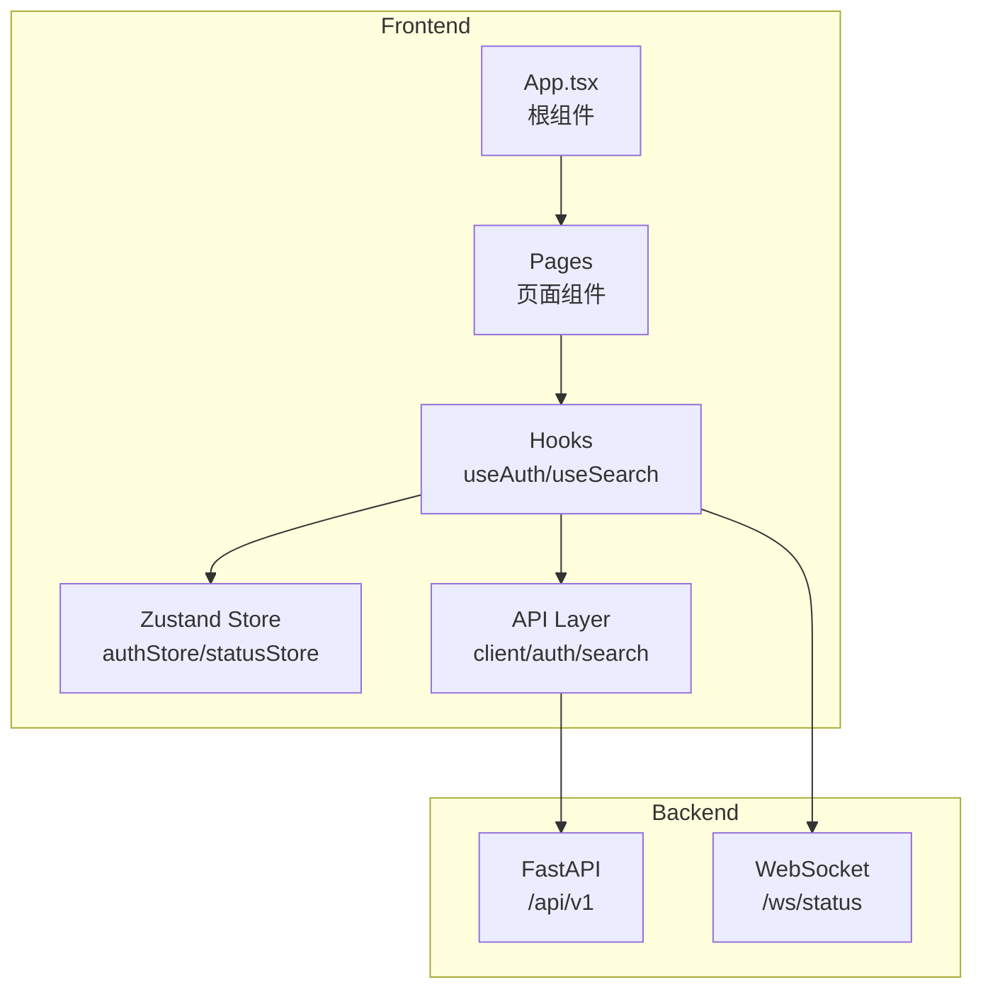

# webui-example 模块文档

> WebUI 前端 - React + TypeScript + Vite 构建的 Telegram 消息搜索界面

**生成时间**: 2026-02-06（最近同步: 2026-02-25）

[返回根目录](../CLAUDE.md)

---

## 模块概述

本模块是 TeleMemory (Meilisearch4TelegramSearchCKJ) 的 Web 前端界面，提供移动优先的 Telegram 消息搜索体验。支持 Telegram 验证码登录、实时搜索、同步状态监控等功能。

### 核心功能

- **Telegram 登录**: 手机号 + 验证码 + 可选 2FA 密码
- **消息搜索**: 支持 CJK 全文搜索，无限滚动分页
- **实时状态**: WebSocket 推送同步进度
- **暗色模式**: 自动适配系统主题

---

## 技术栈

| 类别 | 技术 |
|------|------|
| 框架 | React 19 |
| 语言 | TypeScript 5.8 |
| 构建工具 | Vite 6 |
| 路由 | React Router DOM 7 |
| 状态管理 | Zustand 5 (持久化) |
| 数据请求 | TanStack React Query 5 |
| HTTP 客户端 | Axios |
| WebSocket | react-use-websocket |
| 样式 | Tailwind CSS 4 |

---

## 目录结构

```
webui-example/
├── CLAUDE.md               # 本文档
├── package.json            # 依赖配置
├── vite.config.ts          # Vite 配置
├── index.html              # HTML 入口
└── src/
    ├── main.tsx            # React 入口
    ├── App.tsx             # 根组件 (路由配置)
    ├── index.css           # 全局样式 (Tailwind CSS 4)
    ├── api/                # API 层
    │   ├── client.ts       # Axios 实例 + 拦截器
    │   ├── error.ts        # 错误处理工具
    │   ├── auth.ts         # 认证 API
    │   ├── search.ts       # 搜索 API
    │   ├── dashboard.ts    # 仪表板 API
    │   ├── dialogs.ts      # 会话管理 API
    │   ├── storage.ts      # 存储统计 API
    │   ├── status.ts       # 系统状态 API
    │   ├── config.ts       # 运行时配置 API
    │   └── ai_config.ts    # AI 配置 API
    ├── components/         # 共享组件
    │   ├── BottomNav.tsx   # 底部导航栏
    │   ├── DonutChart.tsx  # 环形图表组件
    │   ├── common/
    │   │   ├── ProtectedRoute.tsx  # 路由守卫
    │   │   └── Highlight.tsx       # 搜索高亮组件
    │   ├── dashboard/
    │   │   ├── ActivityList.tsx    # 最近活动列表
    │   │   └── BriefCard.tsx       # 概览卡片
    │   ├── layout/
    │   │   └── Header.tsx          # 页头组件
    │   └── search/
    │       ├── DateFilter.tsx      # 日期筛选器
    │       └── SenderFilter.tsx    # 发送者筛选器
    ├── hooks/              # React Hooks
    │   ├── useAuth.ts      # 认证 Hook
    │   ├── useSearch.ts    # 搜索 Hook
    │   ├── useWebSocket.ts # WebSocket 状态 Hook
    │   └── queries/        # TanStack Query Hooks
    │       ├── useDashboard.ts  # 仪表板数据
    │       ├── useDialogs.ts    # 会话列表
    │       ├── useSearch.ts     # 搜索查询
    │       ├── useStatus.ts     # 系统状态
    │       └── useStorage.ts    # 存储统计
    ├── pages/              # 页面组件
    │   ├── Login.tsx       # 登录页 (手机号/验证码/2FA/Token)
    │   ├── Dashboard.tsx   # 仪表板首页
    │   ├── Search.tsx      # 搜索页 (无限滚动)
    │   ├── Settings.tsx    # 设置页
    │   ├── Storage.tsx     # 存储统计页
    │   ├── SyncedChats.tsx # 已同步聊天列表
    │   ├── SelectChats.tsx # 选择同步聊天
    │   └── AIConfig.tsx    # AI 配置页
    ├── store/              # Zustand Store
    │   ├── authStore.ts    # 认证状态 (持久化)
    │   └── statusStore.ts  # 同步进度状态
    └── utils/              # 工具函数
        ├── constants.ts    # 常量定义
        └── formatters.ts   # 格式化工具 (formatTime, getInitial, formatBytes)
```

---

## 架构图



---

## 核心模块说明

### API 层 (`src/api/`)

#### `client.ts` - Axios 配置

```typescript
// 自动添加 Bearer Token
api.interceptors.request.use((config) => {
  const token = useAuthStore.getState().token;
  if (token) config.headers.Authorization = `Bearer ${token}`;
  return config;
});

// 401 自动登出
api.interceptors.response.use(
  (response) => response,
  (error) => {
    if (error.response?.status === 401) {
      useAuthStore.getState().logout();
      dispatchAuthExpired(); // 触发全局事件
    }
    return Promise.reject(error);
  }
);
```

#### `auth.ts` - 认证 API

| 方法 | 端点 | 说明 |
|------|------|------|
| `sendCode` | `POST /auth/send-code` | 发送验证码 |
| `signIn` | `POST /auth/signin` | 登录 (验证码 + 可选密码) |
| `me` | `GET /auth/me` | 获取当前用户信息 |
| `logout` | `POST /auth/logout` | 登出 |

#### `search.ts` - 搜索 API

| 方法 | 端点 | 说明 |
|------|------|------|
| `search` | `GET /search` | 搜索消息 (支持分页) |

### Zustand Store (`src/store/`)

#### `authStore.ts` - 认证状态

```typescript
interface AuthState {
  token: string | null;
  user: UserInfo | null;
  isLoggedIn: boolean;
  setAuth: (token: string, user: UserInfo) => void;
  logout: () => void;
}
```

- 使用 `zustand/middleware/persist` 持久化到 localStorage
- Key: `telememory-auth`

#### `statusStore.ts` - 同步进度

```typescript
interface StatusState {
  tasks: Record<number, ProgressEvent>;
  overallStatus: 'idle' | 'syncing' | 'error';
  updateTask: (event: ProgressEvent) => void;
}
```

### Hooks (`src/hooks/`)

#### `useWebSocket.ts` - WebSocket 连接

```typescript
export const useStatusWebSocket = () => {
  const { token } = useAuthStore();
  const wsUrl = token ? `${WS_BASE_URL}/ws/status?token=${token}` : null;

  // 自动重连，间隔 3 秒
  const { lastJsonMessage, readyState } = useWebSocket(wsUrl, {
    shouldReconnect: () => true,
    reconnectInterval: 3000,
  });

  return { lastMessage: lastJsonMessage, connectionStatus: readyState };
};
```

---

## 页面说明

| 页面 | 路由 | 保护 | 说明 |
|------|------|------|------|
| Login | `/login` | 否 | 手机号登录 (3 步：手机号 → 验证码 → 2FA) |
| Dashboard | `/` | 是 | 首页仪表板，显示最近活动 |
| Search | `/search` | 是 | 消息搜索，无限滚动 |
| Settings | `/settings` | 是 | 应用设置 |
| Storage | `/storage` | 是 | 存储使用统计 |
| SyncedChats | `/synced-chats` | 是 | 已同步聊天列表 |
| SelectChats | `/select-chats` | 是 | 选择要同步的聊天 |
| AIConfig | `/ai-config` | 是 | Gemini AI 配置 |

---

## 环境变量

| 变量 | 说明 | 默认值 |
|------|------|--------|
| `VITE_API_URL` | 后端 API 地址 | `/api/v1` |

---

## 运行命令

```bash
cd webui-example

# 安装依赖
npm install

# 开发模式 (端口 3000)
npm run dev

# 生产构建
npm run build

# 预览构建结果
npm run preview
```

---

## 类型定义 (`types.ts`)

```typescript
interface ActivityItem {
  id: number;
  title: string;
  time: string;
  summary: string;
  count?: number;
  image?: string;
  initial?: string;
  bgGradient?: string;
  isOnline?: boolean;
}

interface ChatItem {
  id: number;
  title: string;
  type: 'Group' | 'Channel' | 'Private';
  messages: string;
  status?: 'Real-time' | 'Paused';
}

interface SearchResult {
  id: number;
  title: string;
  time: string;
  subtext: string;
  context: {
    prev: string;
    match: { sender: string; text: string; highlight: string; after: string };
    next: string;
  };
}
```

---

## 开发注意事项

### 认证流程

1. 用户输入手机号 → 调用 `sendCode`
2. 用户输入验证码 → 调用 `signIn`
3. 如需 2FA → 服务端返回 `PASSWORD_REQUIRED` → 显示密码输入
4. 登录成功 → Token 存入 Zustand → 跳转首页

### 搜索实现

- 使用 TanStack Query 的 `useInfiniteQuery`
- 300ms 防抖
- 无限滚动分页 (每页 20 条)
- 搜索结果高亮使用 `<Highlight>` 组件 (DOMPurify 防 XSS)

### WebSocket 状态

- 连接地址: `ws://host/api/v1/ws/status?token=xxx`
- 自动重连 (3 秒间隔)
- 消息格式: `{ type: "progress", data: { dialog_id, dialog_title, current, total, percentage, status } }`

---

## 与后端 API 对接

本前端对接 `src/tg_search/api/` 模块提供的 FastAPI 接口。

| 前端模块 | 后端模块 | 说明 |
|----------|----------|------|
| `src/api/auth.ts` | `api/routes/auth.py` | 认证接口 |
| `src/api/search.ts` | `api/routes/search.py` | 搜索接口 |
| `src/api/dashboard.ts` | `api/routes/dashboard.py` | 仪表板数据 |
| `src/api/dialogs.ts` | `api/routes/dialogs.py` | 会话管理 |
| `src/api/storage.ts` | `api/routes/storage.py` | 存储统计 |
| `src/api/status.ts` | `api/routes/status.py` | 系统状态 |
| `src/api/config.ts` | `api/routes/config.py` | 运行时配置 |
| `src/api/ai_config.ts` | `api/routes/ai_config.py` | AI 配置 |
| `src/hooks/useWebSocket.ts` | `api/routes/ws.py` | 实时状态 |

---

## AI 使用指引

### 修改代码时注意

1. **路由保护**: 所有需认证页面使用 `<ProtectedRoute>` 包裹
2. **Token 处理**: 已在 `client.ts` 自动添加，无需手动处理
3. **401 处理**: 已全局拦截，自动登出并跳转登录页
4. **样式**: 使用 Tailwind CSS，支持 `dark:` 前缀切换暗色模式
5. **类型安全**: 所有 API 响应需定义 TypeScript 接口

### 常见任务

- **添加新页面**: 在 `pages/` 创建组件，在 `App.tsx` 添加路由
- **添加新 API**: 在 `src/api/` 创建模块，导出接口函数
- **添加新 Hook**: 在 `src/hooks/` 创建，使用 Zustand store 管理状态
- **添加新 Store**: 在 `src/store/` 创建，使用 `persist` 中间件实现持久化
