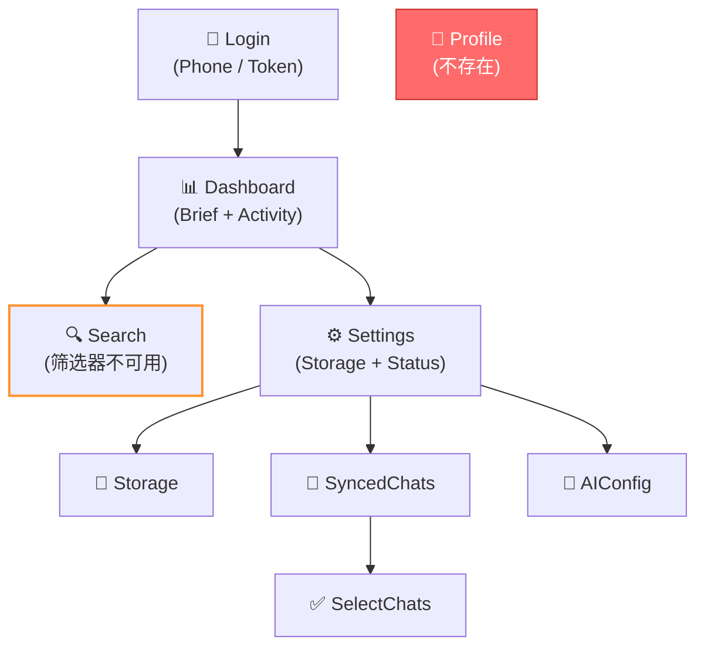
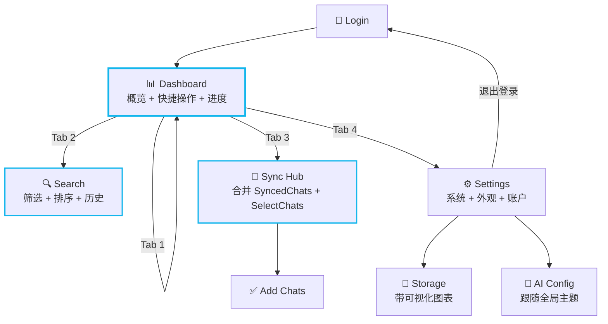
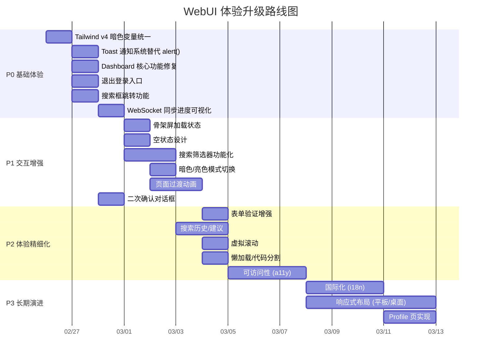

# WebUI 体验差距分析报告

> **分析范围**：`webui-example/` 全部 8 个页面、7 个组件、10 个 API 模块、CSS/主题系统、路由架构
>
> **基准对标**：Telegram Desktop / Telegram iOS 等一线即时通讯产品的管理后台体验

---

## 总览评分

| 维度 | 当前评分 (1-10) | 目标评分 | 差距等级 |
|------|:---------:|:--------:|:--------:|
| 视觉设计 | 5.5 | 9 | 🟡 中 |
| 交互体验 | 3.5 | 9 | 🔴 大 |
| 功能完整度 | 4 | 8.5 | 🔴 大 |
| 性能与流畅度 | 6 | 9 | 🟡 中 |
| 可访问性 (a11y) | 2 | 7 | 🔴 大 |
| 信息架构 | 5 | 8 | 🟡 中 |
| 错误处理与反馈 | 3 | 8 | 🔴 大 |
| 响应式适配 | 4 | 8 | 🟡 中 |
| 国际化 (i18n) | 0 | 7 | 🔴 大 |

---

## 一、视觉设计

### 1.1 色彩系统 — 🟡 中

| 项目 | 现状 | 理想状态 |
|------|------|----------|
| 主色 | 仅 1 个 `#13b6ec` (primary) | 需要完整调色板：primary-50~900、secondary、accent |
| 暗色模式 | 8+ 硬编码 hex（`#192d33`、`#325a67`、`#233f48` 等）散落各组件 | 统一 CSS 变量，语义化 token（card、border、muted） |
| 状态色 | 直接用 Tailwind 的 `red-500`、`green-500` | 定义 success / warning / error / info 语义色 |
| 渐变色 | 头像渐变色硬编码在 [SyncedChats.tsx](file:///home/sinfor/Games/SteamLibrary/CODE/Meilisearch4TelegramSearchCKJ/webui-example/src/pages/SyncedChats.tsx) 中 | 提取为全局渐变色 token 数组 |

> [!WARNING]
> 暗色主题中大量硬编码 hex 值（如 `dark:bg-[#192d33]`）导致一致性差、维护困难，已在 [SPEC-P2-search-filters-theme.md](file:///home/sinfor/Games/SteamLibrary/CODE/Meilisearch4TelegramSearchCKJ/docs/specs/SPEC-P2-search-filters-theme.md) 中规划。

### 1.2 排版系统 — 🟡 中

| 项目 | 现状 | 理想状态 |
|------|------|----------|
| 字体 | `Inter` 通过 CDN 引入 | 正确，但缺少 fallback 中文字体 |
| 字号层级 | 各页面自行用 `text-sm`/`text-lg`/`text-3xl` | 定义 heading/body/caption 语义类 |
| 行高 | 多处使用默认或 `leading-tight`/`leading-relaxed` 混用 | 统一为 3 级行高 token |
| 字重 | `font-bold`、`font-semibold`、`font-medium` 混用 | 限定为 3-4 个语义字重 |

### 1.3 间距与布局 — 🟡 中

| 项目 | 现状 | 理想状态 |
|------|------|----------|
| 间距 | `px-4`/`px-6`/`p-4`/`p-5` 随意使用 | 4px 网格系统，统一使用 4/8/12/16/24/32 |
| 圆角 | `rounded-xl`/`rounded-2xl`/`rounded-full`/`rounded-lg` 混用 | 定义 3 级圆角 token |
| 容器 | `max-w-md` 硬限制，无法适配平板/桌面 | 响应式断点支持 sm/md/lg |
| 底部导航高度 | `pb-24`/`pb-32` 各页面不一致 | 统一的 `safe-bottom-padding` 变量 |

### 1.4 图标系统 — 🟢 基本可用

| 项目 | 现状 | 理想状态 |
|------|------|----------|
| 图标库 | Material Symbols Outlined (CDN) | ✅ 选择良好 |
| 图标风格 | 大多 outlined，个别 `fill-1` | 统一规则：Tab 激活 = filled，其他 = outlined |
| 尺寸 | `!text-[20px]`/`text-2xl`/`text-3xl` 混用 | 定义 sm(18)/md(24)/lg(28) 三级 |

---

## 二、交互体验

### 2.1 页面过渡动画 — 🔴 缺失

| 项目 | 现状 | 理想状态 |
|------|------|----------|
| 路由切换 | 无过渡，直接硬切 | 水平滑动 / 淡入淡出过渡（`framer-motion` 或 CSS transition） |
| 列表加载 | 加载完成后一次性渲染 | 列表项依次入场动画（stagger animation） |
| 模态框/面板 | 无 | 底部弹出 sheet / 淡入面板 |
| 骨架屏 | 无，仅一个 `animate-spin` 圆环 | 按页面结构显示骨架占位 |

### 2.2 触摸反馈 — 🔴 严重不足

| 项目 | 现状 | 理想状态 |
|------|------|----------|
| 按钮点击 | 部分有 `active:scale-[0.98]` | 所有可交互元素都需要 press 反馈 + ripple 效果 |
| 列表滑动 | 无 | 左滑删除、右滑标记等手势操作 |
| 下拉刷新 | 无 | 核心列表页支持下拉刷新（Dashboard / SyncedChats） |
| 长按操作 | 无 | 长按搜索结果可复制/跳转原始消息 |
| 触觉反馈 | 无 | 移动端支持 `navigator.vibrate()` 关键操作反馈 |

### 2.3 表单交互 — 🟡 中

| 项目 | 现状 | 理想状态 |
|------|------|----------|
| 输入验证 | 仅 `!phoneNumber` 空值检测 | 实时格式验证、错误高亮、提示文案 |
| 密码输入 | 有显示/隐藏切换（AIConfig） | Login 的 2FA 密码也需要 |
| 自动聚焦 | 无 | 登录步骤切换后自动聚焦下一输入框 |
| 键盘支持 | 无 | Enter 提交、Tab 切换字段 |

### 2.4 导航架构 — 🟡 中

| 项目 | 现状 | 理想状态 |
|------|------|----------|
| 底部导航 | 4 tab（Chats/Search/Settings/Profile） | Profile 未实现，应去掉或显示未实现提示 |
| 面包屑 | 无 | 深层页面（如 Settings → AI Config）需要面包屑 |
| 手势返回 | 依赖浏览器返回按钮 | 支持 iOS 风格的左滑返回 |
| 深度链接 | `HashRouter` | 建议改为 `BrowserRouter`，支持 URL 直达 |

---

## 三、功能完整度

### 3.1 核心功能缺失 — 🔴 严重

| 缺失功能 | 影响 | 建议优先级 |
|----------|------|:---------:|
| **搜索筛选器不可用** | Search 页的 Date / Sender 筛选 Chip 是纯静态 UI，无实际功能 | P0 |
| **排序按钮无功能** | "Sort by Relevance" 按钮无逻辑 | P1 |
| ~~**Dashboard 搜索框无功能**~~ | ~~搜索输入框不跳转到 Search 页~~ | ✅ 已通过 SPEC-P0-dashboard-core 实现 |
| **Header 按钮无功能** | 菜单 (☰) 按钮无事件；~~设置按钮无事件~~ | 🟡 设置按钮已通过 SPEC-P0-dashboard-core 实现 |
| **Profile 页不存在** | BottomNav 中有 Profile tab 但无对应路由 | P1 |
| **FAB 按钮无功能** | ~~Dashboard~~ 和 Search 页的浮动按钮无逻辑 | 🟡 Dashboard FAB 已实现 |
| ~~**WebSocket 进度条无可视化**~~ | ~~有 store 但无 UI 展示同步进度~~ | ✅ 已通过 SPEC-P0-dashboard-core 实现 |
| **暗色/亮色模式切换** | `<html class="dark">` 写死，用户无法切换 | P1 |
| ~~**退出登录入口**~~ | ~~无明显的退出登录按钮~~ | ✅ 已通过 SPEC-P0-logout-entry 实现 |

### 3.2 页面级功能评估

````carousel
### Login 页 — ⭐ 6/10

**优点**：
- Phone / Token 双模式切换清晰
- 验证码倒计时体验良好
- 2FA 密码步骤处理合理

**缺失**：
- 无表单实时验证（手机号格式）
- 无自动聚焦
- 无密码输入安全检查
- 无 "记住我" 选项
- 无品牌 onboarding 引导
<!-- slide -->
### Dashboard 页 — ⭐ 5/10

**优点**：
- 有 BriefCard 摘要组件
- ActivityList 有良好的渐变色头像

**缺失**：
- ~~搜索框无功能~~ (✅ 已实现跳转)
- ~~无系统状态概览~~ (✅ 已实现 StatusCard)
- ~~无同步进度实时显示~~ (✅ 已实现 SyncProgress)
- ~~无统计数据卡片~~ (✅ 已实现 StatusCard)
- ~~Header 按钮全部无功能~~ (✅ 设置按钮已实现)
- ~~FAB 按钮 (`chat_add_on`) 无功能~~ (✅ 已实现跳转)
<!-- slide -->
### Search 页 — ⭐ 5.5/10

**优点**：
- TanStack Query `useInfiniteQuery` 无限滚动
- 300ms 防抖搜索
- 搜索高亮 (`<Highlight>`)
- 清空按钮

**缺失**：
- 筛选器纯装饰（Date / Sender）
- 排序功能不可用
- 无搜索历史记录
- 无搜索建议/自动补全
- 无搜索结果为空时的引导
- 无虚拟滚动（100+ 结果时性能隐患）
- 结果卡片无法跳转到 Telegram 原始消息
- FAB 按钮无功能
<!-- slide -->
### Settings 页 — ⭐ 5/10

**优点**：
- Storage Card 有实时数据
- System Status 有连接状态指示
- AI Config / Synced Chats 配置卡片设计良好

**缺失**：
- 设置齿轮按钮无功能 (✅ 部分实现)
- more_horiz 按钮无功能
- ~~无退出登录入口~~ (✅ 已在底部实现)
- 无暗色模式切换
- 无版本信息
- 无语言切换
- 无通知设置
- 无下载控制（启动/停止）入口
<!-- slide -->
### Storage 页 — ⭐ 6/10

**优点**：
- 清晰的存储统计展示
- Auto-clean 切换功能完整
- Cache / Media 清理操作分类

**缺失**：
- 环形图表组件 (`DonutChart.tsx`) 存在但未使用
- 无可视化存储占比（饼图/柱状图）
- ~~`alert()` 作为操作反馈 — 应使用 toast 通知~~ (✅ 已通过 `react-hot-toast` 解决)
- Media cleanup 提示"不可用"但按钮仍可点击
<!-- slide -->
### SyncedChats 页 — ⭐ 6.5/10

**优点**：
- 同步状态统计清晰
- Pause/Resume 切换完整
- 渐变色头像 + 状态指示点

**缺失**：
- 无聊天搜索/筛选（搜索按钮无功能）
- 无删除同步配置入口
- 无批量操作
- 无同步进度展示（当前正在下载哪个 chat）
<!-- slide -->
### SelectChats 页 — ⭐ 7/10

**优点**：
- Select All / Deselect All
- 图标按 dialog 类型区分
- 同步状态标签清晰
- 底部固定按钮 + 已选数量

**缺失**：
- 无搜索/筛选功能
- 长列表无虚拟滚动
- 无分组展示（按类型 channel/group/private）
<!-- slide -->
### AIConfig 页 — ⭐ 5.5/10

**优点**：
- 连通性测试功能完整
- 密码显示/隐藏切换
- datalist 模型建议

**缺失**：
- **强制暗色模式** — 不跟随全局主题
- 不使用 React Query（手动 useEffect + 状态管理）
- 无配置历史/变更日志
- `max-w-[430px]` 硬编码 — 与全局 `max-w-md` 不一致
````

---

## 四、错误处理与用户反馈

### 4.1 反馈机制 — 🔴 严重不足

| 项目 | 现状 | 理想状态 |
|------|------|----------|
| 成功反馈 | ~~`alert()` (Storage 页)~~ | ✅ 已集成 `react-hot-toast` 系统 |
| 错误展示 | 红色块状文本 `bg-red-100 border-red-400` | 统一 Toast / Banner 组件 + 错误代码映射 |
| 确认对话框 | 无 | 敏感操作（清理缓存/删除同步）需二次确认 |
| 加载状态 | 仅 `animate-spin` 圆环 | 骨架屏 + 加载进度文案 |
| 空状态 | 大多缺失 | 各列表页需要精心设计的空状态图 + 引导操作 |
| 网络断连 | 无处理 | 全局离线提示 banner + 自动重连 |

### 4.2 错误信息国际化

当前所有错误文案均为英文硬编码，如：
- `"Invalid verification code"`
- `"Failed to fetch results"`
- `"No results found for..."`

应提取为 i18n 资源文件。

---

## 五、性能与技术债务

### 5.1 技术债务清单

| 问题 | 文件 | 影响 |
|------|------|------|
| ~~Tailwind v4 `@theme` 与 v3 `tailwind.config.js` 共存~~ | ~~已解决~~ | ✅ 已通过 SPEC-P0-tailwind-v4-unification 完成，`tailwind.config.js` 已删除 |
| [formatBytes()](file:///home/sinfor/Games/SteamLibrary/CODE/Meilisearch4TelegramSearchCKJ/webui-example/src/pages/Settings.tsx#15-22) 函数在 [Settings.tsx](file:///home/sinfor/Games/SteamLibrary/CODE/Meilisearch4TelegramSearchCKJ/webui-example/src/pages/Settings.tsx) 和 [Storage.tsx](file:///home/sinfor/Games/SteamLibrary/CODE/Meilisearch4TelegramSearchCKJ/webui-example/src/pages/Storage.tsx) 中重复定义 | 两个文件 | 代码重复 |
| AIConfig 不使用 React Query，手动管理 `useEffect` + `useState` | [AIConfig.tsx](file:///home/sinfor/Games/SteamLibrary/CODE/Meilisearch4TelegramSearchCKJ/webui-example/src/pages/AIConfig.tsx) | 与全局数据获取模式不一致 |
| `geminiService.ts` — `@google/genai` 依赖已计划移除 | `services/` | 死代码 |
| `types/index.ts` 中的旧类型定义 | `types/` | 可能包含未清理的遗留类型 |
| [DonutChart.tsx](file:///home/sinfor/Games/SteamLibrary/CODE/Meilisearch4TelegramSearchCKJ/webui-example/src/components/DonutChart.tsx) 已实现但未被任何页面使用 | `components/` | 死代码 |

### 5.2 性能优化空间

| 项目 | 现状 | 优化方案 |
|------|------|----------|
| 列表渲染 | 全量 DOM 渲染 | 引入 `react-virtuoso` 虚拟滚动（Search/SelectChats） |
| 路由懒加载 | 所有页面打包在一个 chunk | `React.lazy()` + `Suspense` 代码分割 |
| 图片加载 | 无图片资源 | 头像如果未来支持，需 lazy loading |
| 字体加载 | 阻塞渲染 | `display=swap` ✅ 已设置 |
| Bundle 分析 | 未知 | 需运行 `npx vite-bundle-visualizer` 检查 |

---

## 六、可访问性 (Accessibility)

### 6.1 现状 — 🔴 严重不足

| 项目 | 现状 | 标准要求 |
|------|------|----------|
| ARIA 标签 | 几乎全部缺失 | 所有交互元素需 `aria-label` |
| 键盘导航 | 不可用 | Tab 焦点管理 + Enter 确认 + Escape 关闭 |
| 色彩对比度 | 未验证 | WCAG AA 标准（4.5:1 正文，3:1 大文本） |
| 屏幕阅读器 | 完全不支持 | 语义化 HTML + ARIA landmarks |
| 焦点指示器 | Tailwind 默认 `focus:ring` | 统一高可见焦点环 |
| 动画偏好 | 未尊重 | `prefers-reduced-motion` 适配 |

---

## 七、信息架构与导航

### 7.1 当前页面结构



### 7.2 建议改进的信息架构



**关键改进**：
1. **合并 SyncedChats + SelectChats** → 统一为 "Sync Hub"，减少导航深度
2. **去掉 Profile tab** 或实现为 Settings 子项
3. **Dashboard 增加系统状态 + 同步进度**，减少跳转
4. **设置页增加退出登录** 入口

---

## 八、响应式设计

### 现状 — 🟡 仅移动端可用

| 项目 | 现状 | 理想状态 |
|------|------|----------|
| 容器策略 | `max-w-md mx-auto` 固定窄宽 | 响应式布局 sm/md/lg/xl |
| 平板适配 | 大量空白，内容压缩在窄条中 | 侧边栏 + 内容区双栏 |
| 桌面适配 | 同上 | 三栏布局（导航 + 列表 + 详情） |
| 底部导航 | 移动端 BottomNav | 桌面端转为左侧边栏 |
| AIConfig 硬编码 | `max-w-[430px]` 限制 | 跟随全局容器策略 |

---

## 九、国际化 (i18n)

### 现状 — 🔴 完全缺失

所有 UI 文案均为英文硬编码在 TSX 中：

| 类别 | 示例 |
|------|------|
| 页面标题 | `"Settings & Management"`, `"Storage & Cleanup"` |
| 按钮文案 | `"Send Login Code"`, `"Start Syncing"` |
| 状态文案 | `"Real-time"`, `"Sync paused"` |
| 错误文案 | `"Invalid verification code"` |
| 占位文案 | `"Search history (CJK support)..."` |

> [!IMPORTANT]
> 项目定位为中日韩 (CJK) 消息搜索工具，用户群以中文用户为主，但 UI 全部为英文。建议至少支持中/英双语。

---

## 十、已规划 vs 未覆盖缺口

以下对比现有 SPEC 文档已规划的改进与本报告发现的缺口：

| 缺口 | 已有 SPEC 覆盖？ | 说明 |
|------|:----------------:|------|
| Tailwind v4 统一 | ✅ 已完成归档 → [COMPLETED_SPECS.md](file:///home/sinfor/Games/SteamLibrary/CODE/Meilisearch4TelegramSearchCKJ/docs/specs/completed/COMPLETED_SPECS.md) | Phase A 暗色变量统一 |
| 搜索筛选器 | ✅ [SPEC-P2-search-filters-theme.md](file:///home/sinfor/Games/SteamLibrary/CODE/Meilisearch4TelegramSearchCKJ/docs/specs/SPEC-P2-search-filters-theme.md) | Date + Sender 筛选 |
| 死代码清理 | ✅ 已完成归档 → [COMPLETED_SPECS.md](file:///home/sinfor/Games/SteamLibrary/CODE/Meilisearch4TelegramSearchCKJ/docs/specs/completed/COMPLETED_SPECS.md) | geminiService 等 |
| 工具函数整理 | ✅ 已完成归档 → [COMPLETED_SPECS.md](file:///home/sinfor/Games/SteamLibrary/CODE/Meilisearch4TelegramSearchCKJ/docs/specs/completed/COMPLETED_SPECS.md) | formatBytes 去重等 |
| **页面过渡动画** | ✅ [SPEC-P1-page-transitions.md](file:///home/sinfor/Games/SteamLibrary/CODE/Meilisearch4TelegramSearchCKJ/docs/specs/SPEC-P1-page-transitions.md) | framer-motion 路由过渡 + stagger |
| **Toast 通知系统** | ✅ [SPEC-P0-toast-notification.md](file:///home/sinfor/Games/SteamLibrary/CODE/Meilisearch4TelegramSearchCKJ/docs/specs/SPEC-P0-toast-notification.md) | 替代 `alert()` |
| **骨架屏/加载状态** | ✅ [SPEC-P1-skeleton-empty-states.md](file:///home/sinfor/Games/SteamLibrary/CODE/Meilisearch4TelegramSearchCKJ/docs/specs/SPEC-P1-skeleton-empty-states.md) | Skeleton + EmptyState |
| **空状态设计** | ✅ ↑ 同上 | 含空状态设计 |
| **Dashboard 核心功能** | ✅ [SPEC-P0-dashboard-core.md](file:///home/sinfor/Games/SteamLibrary/CODE/Meilisearch4TelegramSearchCKJ/docs/specs/SPEC-P0-dashboard-core.md) | 搜索跳转 + 进度展示 + 状态概览 |
| **退出登录** | ✅ [SPEC-P0-logout-entry.md](file:///home/sinfor/Games/SteamLibrary/CODE/Meilisearch4TelegramSearchCKJ/docs/specs/SPEC-P0-logout-entry.md) | Settings 页退出入口 |
| **暗色/亮色模式切换** | ✅ [SPEC-P1-dark-light-toggle.md](file:///home/sinfor/Games/SteamLibrary/CODE/Meilisearch4TelegramSearchCKJ/docs/specs/SPEC-P1-dark-light-toggle.md) | Dark/Light/System 三选项 |
| **国际化 (i18n)** | ✅ [SPEC-P3-i18n.md](file:///home/sinfor/Games/SteamLibrary/CODE/Meilisearch4TelegramSearchCKJ/docs/specs/SPEC-P3-i18n.md) | react-i18next 中/英双语 |
| **可访问性 (a11y)** | ✅ [SPEC-P3-a11y.md](file:///home/sinfor/Games/SteamLibrary/CODE/Meilisearch4TelegramSearchCKJ/docs/specs/SPEC-P3-a11y.md) | WCAG 2.1 AA |
| **响应式布局** | ✅ [SPEC-P3-responsive-layout.md](file:///home/sinfor/Games/SteamLibrary/CODE/Meilisearch4TelegramSearchCKJ/docs/specs/SPEC-P3-responsive-layout.md) | 平板双栏 / 桌面三栏 |
| **搜索历史/建议** | ✅ [SPEC-P2-search-enhancements.md](file:///home/sinfor/Games/SteamLibrary/CODE/Meilisearch4TelegramSearchCKJ/docs/specs/SPEC-P2-search-enhancements.md) | 历史 + 自动建议 + 深链接 |
| **二次确认对话框** | ✅ [SPEC-P2-confirmation-dialog.md](file:///home/sinfor/Games/SteamLibrary/CODE/Meilisearch4TelegramSearchCKJ/docs/specs/SPEC-P2-confirmation-dialog.md) | 替代 confirm() |
| **下拉刷新** | ❌ 未覆盖 | — |
| **虚拟滚动** | ✅ ↑ SPEC-P2-search-enhancements | react-virtuoso |
| **代码分割/懒加载** | ✅ [SPEC-P2-code-splitting.md](file:///home/sinfor/Games/SteamLibrary/CODE/Meilisearch4TelegramSearchCKJ/docs/specs/SPEC-P2-code-splitting.md) | React.lazy + Vite chunks |
| **全局离线提示** | ❌ 未覆盖 | — |
| **Profile 页或移除** | ❌ 未覆盖 | — |

---

## 十一、建议实施路线图



### 优先级分层说明

| 分层 | 原则 | 包含项 |
|------|------|--------|
| **P0** | 阻碍基本使用 / 功能性缺陷 | 暗色变量统一、Toast、Dashboard 修复、退出登录、进度可视化 |
| **P1** | 显著影响用户体验 | 骨架屏、空状态、筛选器、模式切换、过渡动画 |
| **P2** | 提升体验质量 | 表单验证、搜索增强、虚拟滚动、a11y |
| **P3** | 扩展用户群 / 长期规划 | i18n、响应式、Profile 页 |

---

## 附录：文件级审计参考

| 文件 | 行数 | 主要问题 |
|------|:----:|----------|
| [App.tsx](file:///home/sinfor/Games/SteamLibrary/CODE/Meilisearch4TelegramSearchCKJ/webui-example/src/App.tsx) | 83 | HashRouter → BrowserRouter 建议 |
| [Login.tsx](file:///home/sinfor/Games/SteamLibrary/CODE/Meilisearch4TelegramSearchCKJ/webui-example/src/pages/Login.tsx) | 344 | 无表单验证、无自动聚焦 |
| [Dashboard.tsx](file:///home/sinfor/Games/SteamLibrary/CODE/Meilisearch4TelegramSearchCKJ/webui-example/src/pages/Dashboard.tsx) | 72 | 搜索框/Header/FAB 均无功能 |
| [Search.tsx](file:///home/sinfor/Games/SteamLibrary/CODE/Meilisearch4TelegramSearchCKJ/webui-example/src/pages/Search.tsx) | 158 | 筛选器/排序/FAB 均无功能 |
| [Settings.tsx](file:///home/sinfor/Games/SteamLibrary/CODE/Meilisearch4TelegramSearchCKJ/webui-example/src/pages/Settings.tsx) | 145 | 无退出登录、无模式切换 |
| [Storage.tsx](file:///home/sinfor/Games/SteamLibrary/CODE/Meilisearch4TelegramSearchCKJ/webui-example/src/pages/Storage.tsx) | 169 | DonutChart 未使用、alert() 反馈 |
| [SyncedChats.tsx](file:///home/sinfor/Games/SteamLibrary/CODE/Meilisearch4TelegramSearchCKJ/webui-example/src/pages/SyncedChats.tsx) | 110 | 搜索按钮无功能 |
| [SelectChats.tsx](file:///home/sinfor/Games/SteamLibrary/CODE/Meilisearch4TelegramSearchCKJ/webui-example/src/pages/SelectChats.tsx) | 177 | 无搜索/筛选/分组 |
| [AIConfig.tsx](file:///home/sinfor/Games/SteamLibrary/CODE/Meilisearch4TelegramSearchCKJ/webui-example/src/pages/AIConfig.tsx) | 235 | 强制暗色、不使用 React Query、宽度不一致 |
| [BottomNav.tsx](file:///home/sinfor/Games/SteamLibrary/CODE/Meilisearch4TelegramSearchCKJ/webui-example/src/components/BottomNav.tsx) | 47 | Profile 按钮无路由 |
| [index.css](file:///home/sinfor/Games/SteamLibrary/CODE/Meilisearch4TelegramSearchCKJ/webui-example/src/index.css) | 32 | ~~@theme 与 tailwind.config.js 冲突~~ ✅ 已解决 |
| ~~tailwind.config.js~~ | ~~29~~ | ✅ 已删除（SPEC-P0-tailwind-v4-unification 完成） |
